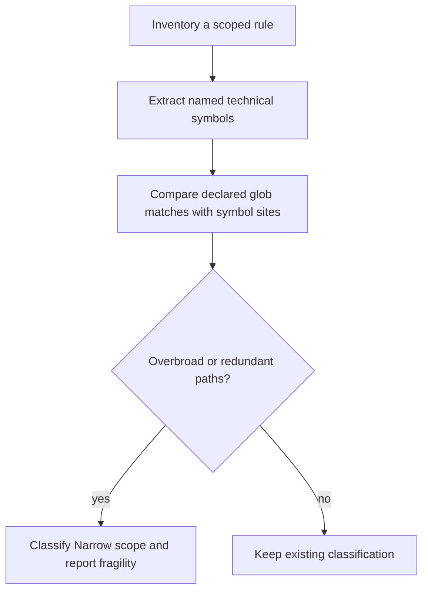
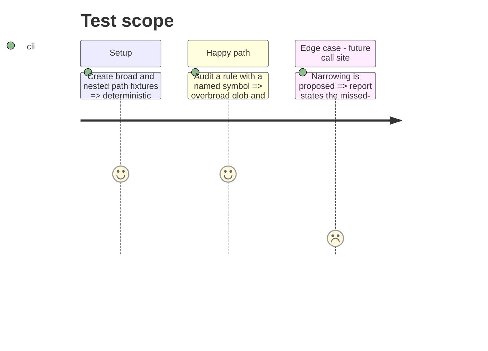

# Instruction: Add narrow-scope analysis to reconcile-normative (#24)

## Architecture projection

> Tree of the final files. ✅ create · ✏️ modify · ❌ delete

```txt
plugins/overcode/
├── ✏️ skills/reconcile-normative/SKILL.md
├── ✏️ skills/reconcile-normative/evals/rule-load-scenarios.md
├── ✅ skills/reconcile-normative/tools/scope-audit.mjs
└── ✅ skills/reconcile-normative/evals/fixtures/scope-audit/
    ├── broad-rule.md
    └── project/lib/...
```

## User Journey



## Test Scope



## Tasks to do

### `1)` Add the missing Phase-D class

> Distinguish a valid rule with an invalidly broad scope from memory migration or resolution.

1. Add `Narrow scope` to the consolidation table.
2. Define the measurable criterion, action, and explicit maintenance-risk disclosure.
3. Require comparison of same-file `paths:` entries for containment redundancy.

### `2)` Make the comparison reproducible

> Provide a deterministic helper for declared globs versus caller sites.

1. Accept a project root, rule file, and one or more named symbols.
2. Report declared-file count, symbol-site files, files covered without a site, sites outside scope, and redundant path entries.
3. Fail closed on malformed frontmatter or unresolved globs.

### `3)` Pin the behavior

> Extend the existing behavioural suite and add executable fixture checks.

1. Cover `Narrow scope`, redundancy, and the future-site warning.
2. Add the helper to the repository test runner.

## Test acceptance criteria

| Task | Acceptance criteria |
| ---- | ------------------- |
| 1 | Phase D has four mutually usable classes and does not demote an enforceable rule to memory merely because its current glob is broad. |
| 2 | The fixture audit reports both an overbroad glob and a child glob already contained by a parent entry, with stable counts. |
| 3 | Removing the narrow-scope instruction or redundancy detection makes the targeted gate fail. |
