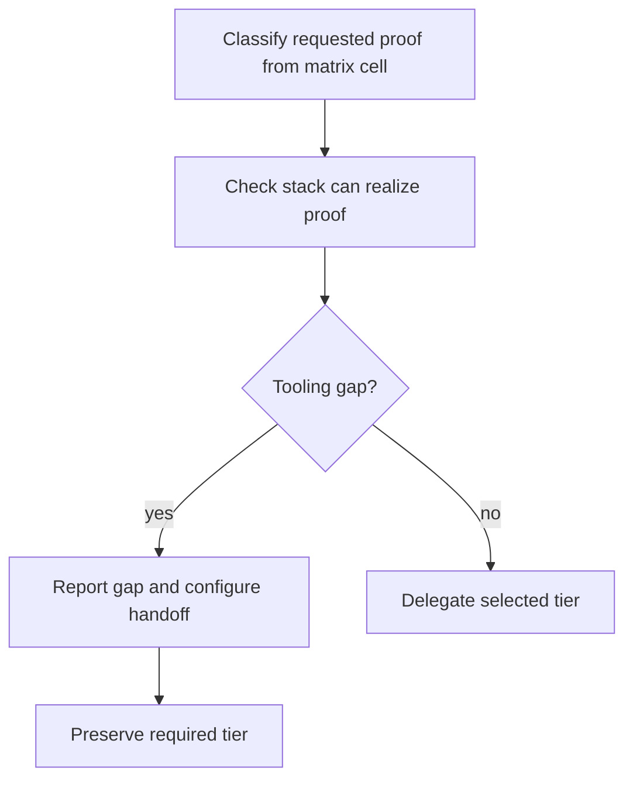
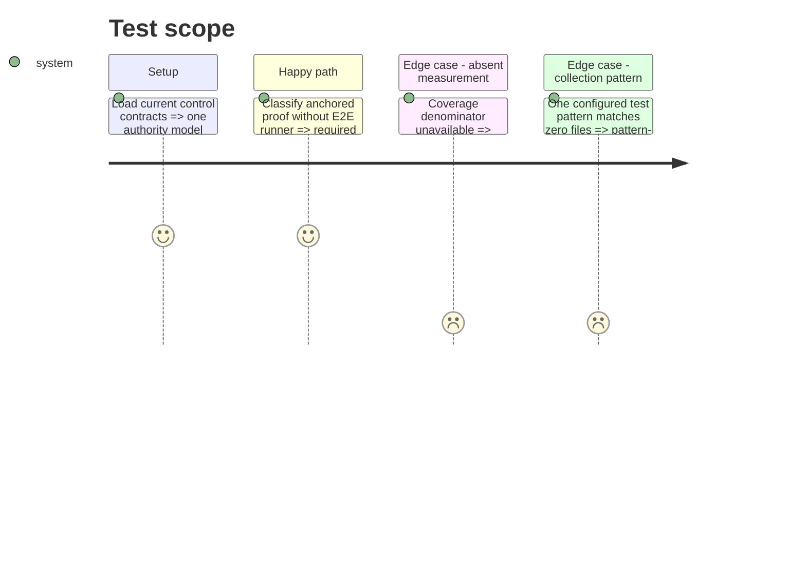

# Instruction: Repair current control target defects (#12)

## Architecture projection

> Tree of the final files. ✅ create · ✏️ modify · ❌ delete

```txt
plugins/overcode/skills/control/
├── ✏️ SKILL.md
├── ✏️ actions/01-write.md
├── ✏️ actions/02-audit.md
├── ✏️ actions/05-stats.md
└── ✏️ references/decision-matrix.md
```

## User Journey



## Test Scope



## Tasks to do

### `1)` Close S17's target gap

> Give `01-write` an explicit output and route for an unavailable proof mechanism.

1. Add a tooling-capability result to the output contract.
2. Preserve the matrix-required proof and tier; never silently downgrade it.
3. Add the intentional `01-write → 03-configure` handoff and define when it executes versus when it is only suggested.

### `2)` Remove authority ambiguity

> Make the matrix cell choose the required proof and let the deciding order only map that proof to an output tier.

1. Rewrite `Deciding among them` around the cell requirement.
2. Align `01-write` and the transversal rule with the same wording.

### `3)` Repair remaining output and discovery defects

> Make absence, casing, collection, and multi-flag outcomes deterministic.

1. Add `not measurable` variants to `outliers` matching `density`.
2. Define exact-case lookup for `aidd_docs/memory/testing.md`, with a differently cased filename reported as a naming defect rather than host-dependent discovery.
3. Report test enumeration per configured pattern, including patterns matching zero files.
4. Require both independent `05-stats` flags when both strategy readability and tool drift apply.
5. Clarify action-chain prose so ordinary `stats` output never looks like an implicit invocation.

## Test acceptance criteria

| Task | Acceptance criteria |
| ---- | ------------------- |
| 1 | A required anchored proof on a project without an E2E runner yields an explicit tooling gap and configure handoff without changing the required tier. |
| 2 | No current instruction can derive `contract` solely because a behavior is internally provable when the selected cell requires anchored proof. |
| 3 | Unmeasurable outliers, exact-case strategy lookup, zero-match patterns, dual flags, and explicit handoff semantics are all stated in their producing actions. |
