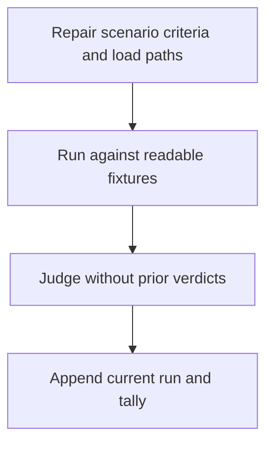
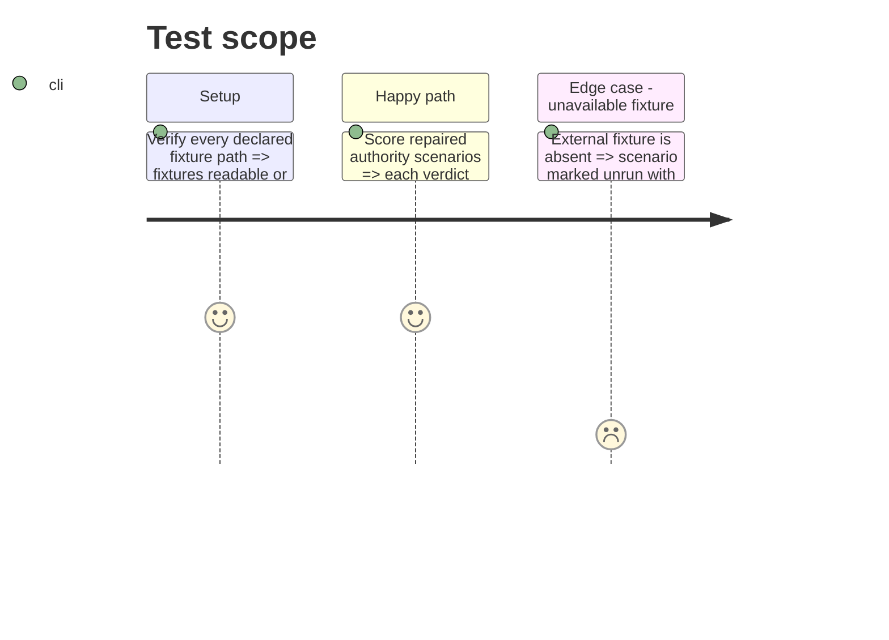

# Instruction: Repair and rerun the control authority suite (#12)

## Architecture projection

> Tree of the final files. ✅ create · ✏️ modify · ❌ delete

```txt
plugins/overcode/skills/control/evals/
└── ✏️ authority-scenarios.md
```

## User Journey



## Test Scope



## Tasks to do

### `1)` Repair known suite defects

> Make the suite capable of detecting the target failures it claims to guard.

1. Add a nested test file to S1's completeness criterion.
2. Add every authority file needed by S4, S5, S11, and S17 to their load paths.
3. Replace vacuous or stale criteria in S6, S7, S8, S14, S15, and S17.
4. Correct the fixture header and remove world-state illustrations from stable criteria.
5. Separate scenario definitions from prior verdicts enough that a judge can load criteria without announced answers.

### `2)` Produce a fresh verdict

> Re-run only on fixtures that are authoritative and available now.

1. Verify fixture identity and preconditions before grading.
2. Record current target evidence and no carried verdict.
3. Append a dated tally; any unavailable scenario is explicit and cannot count as PASS.

## Test acceptance criteria

| Task | Acceptance criteria |
| ---- | ------------------- |
| 1 | Each repaired scenario is falsifiable from its declared load path, includes positive and negative obligations where required, and contains no stale line-number premise. |
| 2 | The newest run distinguishes measured PASS/FAIL from unavailable scenarios and shows S17 detecting the repaired tooling-gap behavior. |
