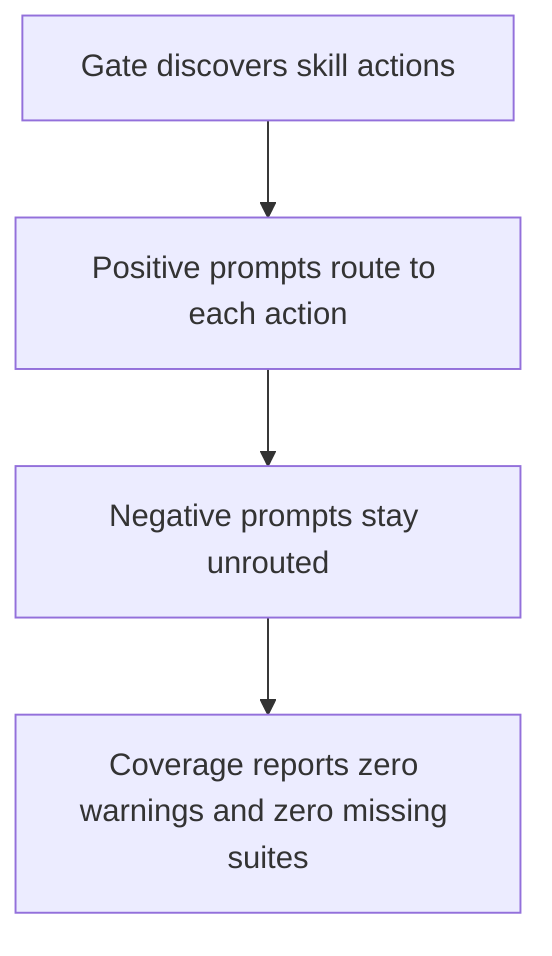
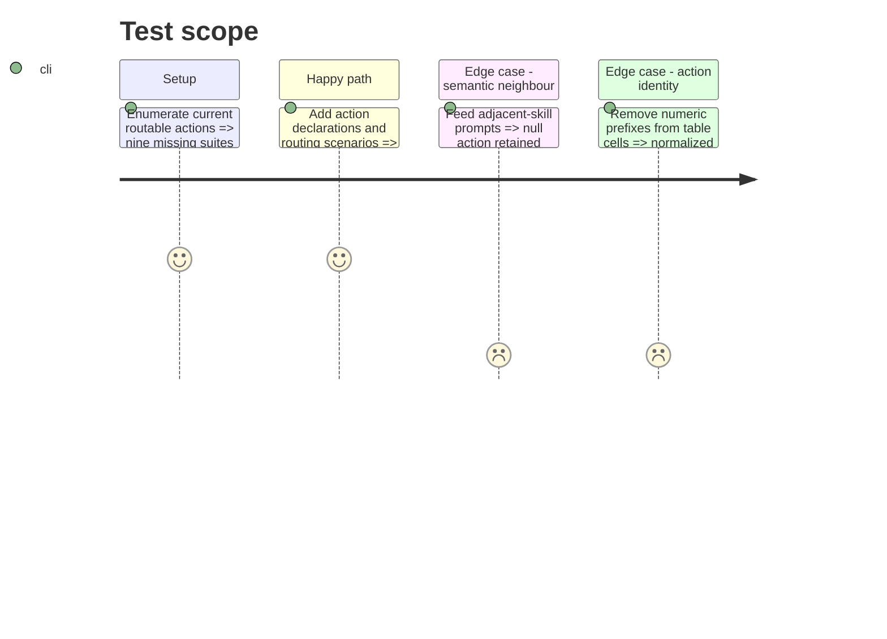

# Instruction: Eliminate current routing-coverage debt (#9)

## Architecture projection

> Tree of the final files. ✅ create · ✏️ modify · ❌ delete

```txt
plugins/
├── overcode/skills/
│   ├── ✏️ seo-optimize/SKILL.md
│   ├── ✏️ web-optimize/SKILL.md
│   ├── ✅ changelog/evals/scenarios.json
│   ├── ✅ control/evals/scenarios.json
│   └── ✅ decompose/evals/scenarios.json
├── sc-css/skills/
│   ├── ✅ audit/evals/scenarios.json
│   ├── ✅ design-bridge/evals/scenarios.json
│   ├── ✅ improve/evals/scenarios.json
│   ├── ✅ sniff/evals/scenarios.json
│   └── ✅ teach/evals/scenarios.json
├── sc-php/skills/
│   └── ✅ audit/evals/scenarios.json
├── sc-js/skills/
│   ├── ✏️ design-bridge/SKILL.md
│   └── ✏️ wp-blocks/SKILL.md
└── sc-php/skills/
    ├── ✏️ design-bridge/SKILL.md
    └── ✏️ builder-coverage/SKILL.md
```

## User Journey



## Test Scope



## Tasks to do

### `1)` Make single-run skills verifiable

> Declare the existing `run` action in the two SKILL files whose scenarios already target it.

1. Add minimal action tables to `seo-optimize` and `web-optimize` without changing their workflow.
2. Retain their existing positive and negative scenario corpus.

### `2)` Cover all nine missing suites

> Add routing contracts for every currently routable action.

1. Add at least two natural positive prompts per action.
2. Add neighbouring negative prompts that would reveal cross-skill over-routing.
3. Keep control's routing suite distinct from its eight behavioural correctness suites.

### `3)` Remove source-level prefix drift

> Make action identity semantic while filenames remain numerically ordered.

1. Remove numeric prefixes from the Action cells in the four named skills.
2. Leave prose references to action filenames unchanged.

## Test acceptance criteria

| Task | Acceptance criteria |
| ---- | ------------------- |
| 1 | `coverage.mjs` can infer `run` for both optimization skills and reports neither as unverifiable. |
| 2 | Every current routable action has positive coverage and at least one relevant null-route guard; the gate reports zero missing routing suites. |
| 3 | The four action tables use semantic action ids while their ordered action files keep numeric prefixes. |
