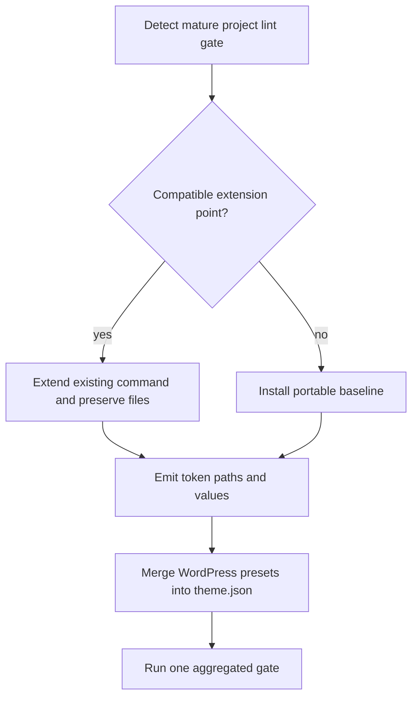
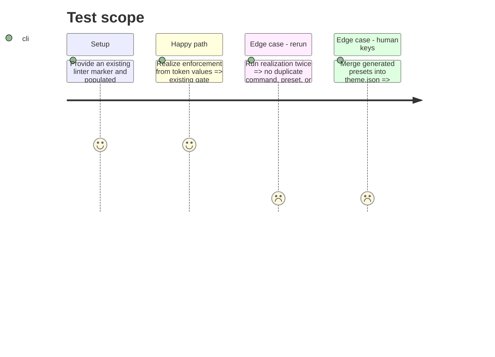

# Instruction: Make design enforcement brownfield-capable (#8)

## Architecture projection

> Tree of the final files. ✅ create · ✏️ modify · ❌ delete

```txt
plugins/
├── design/
│   ├── ✏️ references/sc-pivot-contract.md
│   ├── ✏️ skills/enforce/actions/01-build-linter.md
│   ├── ✏️ skills/enforce/actions/04-pivot.md
│   └── ✏️ skills/enforce/evals/enforcement-scenarios.md
└── sc-php/skills/design-bridge/
    ├── ✏️ actions/01-realize-lint.md
    ├── ✏️ actions/02-render.md
    ├── ✏️ references/wordpress-pitfalls.md
    ├── ✏️ evals/scenarios.json
    └── ✅ evals/fixtures/theme-json/
        ├── tokens.json
        ├── theme.input.json
        └── theme.expected.json
```

## User Journey



## Test Scope



## Tasks to do

### `1)` Add a brownfield linter branch

> Extend a compatible existing DS gate instead of overwriting or installing a parallel authority.

1. Define detection signals and a generated-marker boundary.
2. Preserve human-authored wiring and aggregate into the project's existing command.
3. Fall back to the portable baseline only when no compatible extension point exists.
4. Specify idempotency and refusal behavior for ambiguous existing gates.

### `2)` Transport token values in the enforcement spec

> Make value-in-scale enforcement possible without hidden reads or invented data.

1. Add flattened `Token scales` alongside `Token paths`.
2. State canonical values and theme-overlay handling.
3. Require receptors to enforce membership where their platform exposes raw values.

### `3)` Make WordPress token adaptation first-class

> Merge design tokens into WordPress `theme.json` presets through `sc-php`.

1. Map color, typography sizes, spacing, and other supported scales to deterministic slugs and values.
2. Preserve non-design keys and human-authored sections outside the generated boundary.
3. Make updates idempotent and validate coherence in `01-realize-lint`.
4. Keep stack-specific output in `sc-php`, preserving DEC-002.

### `4)` Pin brownfield behavior

> Add behavioural and fixture checks for extension, values, merge preservation, and reruns.

1. Add positive brownfield and negative ambiguity scenarios.
2. Extend the FSE gate with deterministic theme input/expected fixtures.

## Test acceptance criteria

| Task | Acceptance criteria |
| ---- | ------------------- |
| 1 | A marked compatible existing linter is extended in place, its command remains the single gate entrypoint, and a second run is a no-op. |
| 2 | The emitted spec carries both token paths and the canonical scale values needed to test membership. |
| 3 | WordPress presets derived from tokens are merged idempotently while unrelated `theme.json` content remains byte-for-byte equivalent after structural serialization. |
| 4 | Removing token values, the extension marker, or preservation logic makes the targeted gate fail. |
