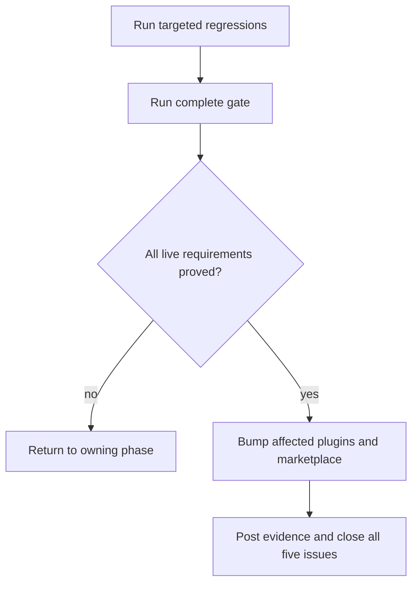
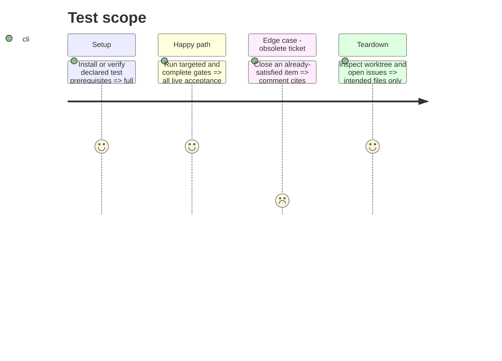

# Instruction: Release, verify, and close the issue set

## Architecture projection

> Tree of the final files. ✅ create · ✏️ modify · ❌ delete

```txt
.
├── ✏️ package.json
├── ✏️ .claude-plugin/marketplace.json
├── ✏️ plugins/design/.claude-plugin/plugin.json
├── ✏️ plugins/design/CHANGELOG.md
├── ✏️ plugins/overcode/.claude-plugin/plugin.json
├── ✏️ plugins/overcode/CHANGELOG.md
├── ✏️ plugins/sc-php/.claude-plugin/plugin.json
├── ✏️ plugins/sc-php/CHANGELOG.md
├── ✏️ aidd_docs/tasks/2026_09/2026_09_23-open-issues-closeout/current-state.md
└── GitHub issues
    └── ✏️ #8, #9, #12, #13, #24 (evidence comment and close)
```

## User Journey



## Test Scope



## Tasks to do

### `1)` Verify at proportional scope

> Prove each requirement with a gate that actually covers it.

1. Run targeted reconcile, control, routing, design, and FSE tests.
2. Run the complete `pnpm test`; distinguish environment prerequisites from code failures and resolve the former when authorized.
3. Re-audit every requirement ledger row against current files and test output.

### `2)` Publish coherent versions

> Keep code, manifests, marketplace metadata, and changelogs synchronized.

1. Bump `overcode`, `design`, and `sc-php` according to delivered compatibility.
2. Bump marketplace version and update plugin entries in the same change.
3. Record only current behavior in changelogs; do not repeat obsolete ticket counts.

### `3)` Close all five issues

> Leave no open issue without a current evidence-backed disposition.

1. Comment #13 with existing delivery evidence and close it without new implementation.
2. Comment #9 with the recalculated baseline, implemented zero-debt result, and obsolete `ERR-09` disposition.
3. Comment #8, #12, and #24 with files and verification evidence, then close them.
4. Confirm the repository reports zero open issues.

## Test acceptance criteria

| Task | Acceptance criteria |
| ---- | ------------------- |
| 1 | Each live requirement has direct current-state evidence and the complete repository gate passes. |
| 2 | Plugin manifests, marketplace entries, and changelogs agree on the released versions. |
| 3 | `gh issue list --state open` returns no issue, and every closure comment distinguishes implemented work from obsolete claims. |
