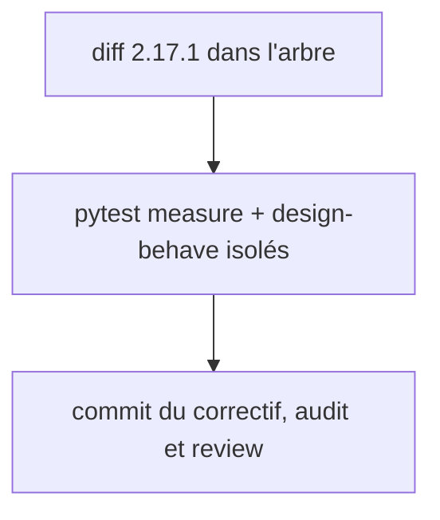

# Instruction: clôture du correctif 2.17.1

## Architecture projection

> Tree of the final files. ✅ create · ✏️ modify · ❌ delete

```txt
.
├── aidd_docs/tasks/2026_09/
│   ├── 2026_09_24_audit/                              ✅ audit (7 piliers + report.md), déjà écrit
│   └── 2026_09_24_fidelity-gate-frozen-by-adjust/review.md  ✅ review, déjà écrite
└── plugins/design/                                    ✏️ diff 2.17.1 déjà présent dans l'arbre, non committé
    ├── adapters/measure/config-gen.py
    ├── adapters/measure/tests/test_config_gen_pages.py
    ├── skills/enforce/{SKILL.md,actions/05-fidelity-gate.md}
    └── CHANGELOG.md
```

## User Journey



## Tasks to do

### `1)` Vérifier le correctif en place

> Le diff 2.17.1 couvre les constats review 1 (collection `skip`), 2 (liste fermée copycat/enforce) et 4 (page `null`).

1. Lancer (avec `PYTHONUTF8=1`) `python -m pytest plugins/design/adapters/measure/tests -q` et `node tools/eval/design-behave.mjs` isolément (la chaîne `pnpm test` est rouge sur `debrief-contract`, corrigé en phase 3).
2. Laisser les fichiers de version à 2.17.1 : la phase 10 les porte à 2.18.0 et fusionne l'entrée `[2.17.1]` du CHANGELOG dans `[2.18.0]`.

### `2)` Committer

1. Un commit pour le diff 2.17.1, les dossiers `2026_09_24_audit/` et `review.md`, et ce plan.

## Test acceptance criteria

| Task | Acceptance criteria              |
| ---- | -------------------------------- |
| 1 | `pytest adapters/measure/tests` passe ; `design-behave.mjs` sort 0 |
| 2 | L'arbre est propre ; le commit contient le correctif, l'audit, la review et le plan |
