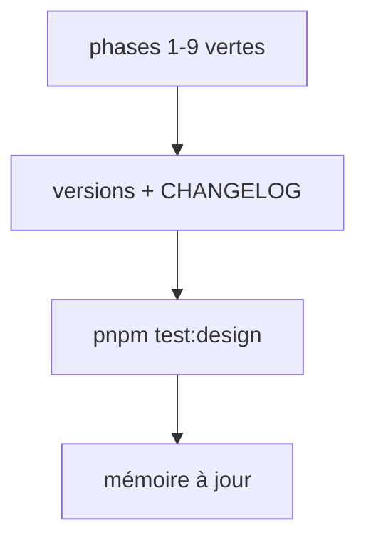

# Instruction: release design 2.18.0

## Architecture projection

> Tree of the final files. ✅ create · ✏️ modify · ❌ delete

```txt
.
├── .claude-plugin/marketplace.json                    ✏️ design 2.18.0
├── aidd_docs/memory/design-plugin.md                  ✏️ version, test:design, CI design
└── plugins/design/
    ├── .claude-plugin/plugin.json                     ✏️ 2.18.0
    ├── .codex-plugin/plugin.json                      ✏️ 2.18.0+codex.<horodatage>
    ├── skills/*/SKILL.md                              ✏️ version: des skills touchées
    └── CHANGELOG.md                                   ✏️ [2.17.1] fusionnée dans [2.18.0]
```

## User Journey



## Tasks to do

### `1)` Versions et journal

1. 2.17.0 → 2.18.0 aux trois emplacements (identité vérifiée par `consistency.mjs`).
2. Bump du champ `version:` de chaque skill dont un fichier a changé depuis 2.17.0 (au moins `detail`, `enforce`, `adjust`, `define`, `destructure`, `diffuse`, `wireframes`, `harness`, selon le diff).
3. CHANGELOG : l'entrée `[2.17.1]` jamais publiée passe dans `[2.18.0]`. Added : `lang` du manifeste wireframes, `requirements-dev.txt`, `test:design`, job CI. Fixed : les 4 faux verts, exit 2, écritures sûres. Security : aucun objet hôte dans le contexte vm (risque résiduel : `node:vm` n'est pas une frontière de sécurité), chemins confinés, échappements, `--allow-file-access-from-files` retiré et réseau de `render-check` bloqué, pillow 12.3.0. Migration : un contrat vert peut passer au rouge (alpha au contraste, `var()` avec fallback, `COLOR_PROPS` complété) et c'est le vrai verdict.

### `2)` Mémoire

1. `design-plugin.md` : version courante, `pnpm test:design` comme preuve des suites design, job CI `design`, liste des constats écartés (voir le plan) pour qu'ils ne reviennent pas au prochain audit.

## Test acceptance criteria

| Task | Acceptance criteria              |
| ---- | -------------------------------- |
| 1 | Les trois fichiers de version portent 2.18.0 ; `consistency.mjs` passe ; le CHANGELOG n'a plus d'entrée `[2.17.1]` séparée |
| 1 | `pnpm test:design` passe |
| 2 | La mémoire nomme 2.18.0, `test:design` et les constats écartés |
