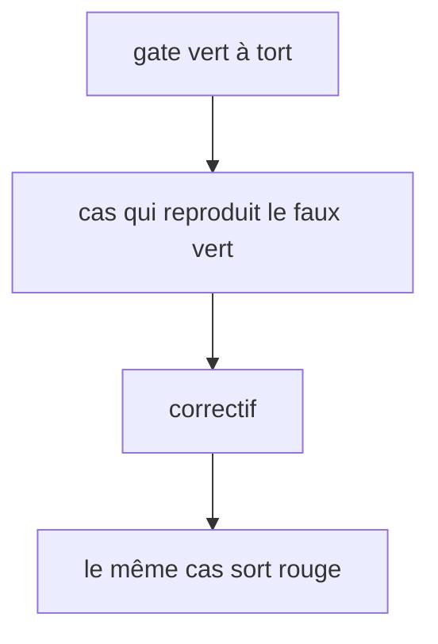

# Instruction: faux verts de gate

## Architecture projection

> Tree of the final files. ✅ create · ✏️ modify · ❌ delete

```txt
.
├── plugins/design/
│   ├── adapters/a11y/contrast.py                          ✏️ alpha fusionnée sur le fond avant la luminance
│   ├── tools/status.py                                    ✏️ fichier présent mais illisible → erreur, plus None
│   ├── tools/run-gates.py                                 ✏️ erreur de status traduite en exit 2
│   ├── tools/migrate-contract.py                          ✏️ erreur de status traduite en exit 2
│   ├── skills/enforce/fixtures/dual-host/design/lint/{status,run-gates}.py  ✏️ copies identiques
│   ├── skills/enforce/adapters/lint-core.mjs              ✏️ regex token-reference accepte espaces et fallback
│   ├── skills/enforce/fixtures/dual-host/design/lint/lint-core.mjs  ✏️ même regex (copie gardée identique)
│   ├── skills/enforce/fixtures/                           ✅ fixture markup avec var(--inconnu, #000)
│   └── skills/detail/references/funnel-map.md             ✏️ lignes define et destructure
└── tools/eval/design-behave.mjs                           ✏️ cas lint fallback + garde funnel-map
```

## User Journey



## Tasks to do

### `1)` Contraste avec alpha

> `to_rgb` jette l'alpha : `#00000020` sur blanc rend 21:1.

1. `to_rgb` renvoie aussi l'alpha (hex à 4 et à 8 chiffres).
2. Premier plan avec alpha < 1 : le fusionner sur le fond avant `ratio`.
3. Fond avec alpha < 1 : exit 2 nommant la paire (ce qui est dessous n'est pas connu).

### `2)` Contrat illisible

> `_read_json` renvoie `None` sur fichier corrompu, puis `check_states` conclut `allPass: true`.

1. `_read_json` : absent → `None` ; présent mais illisible (`OSError`, `ValueError`) → erreur qui nomme le fichier.
2. Le CLI de `status.py` traduit cette erreur en exit 2 ; `release.json` n'est jamais écrit sur ce chemin.
3. `run-gates.py` et `migrate-contract.py` appellent `observe` : ils attrapent la même erreur et sortent en 2 (`raise abort(...)` côté `run-gates`).
4. Recopier `status.py` et `run-gates.py` dans `skills/enforce/fixtures/dual-host/design/lint/` (identité exigée par `design-behave.mjs:144-148`).

### `3)` `var()` avec fallback

1. Dans les deux copies de `lint-core.mjs` : `/var\(\s*(--[\w-]+)\s*[,)]/g`.
2. Fixture markup avec `var(--inconnu, #000)` et `var( --inconnu )` ; `design-behave.mjs` exige une violation `token-reference` pour chacune.

### `4)` Carte de l'entonnoir

1. `funnel-map.md` : define → `tokens.json` + `design-system.md` (comme `define/actions/04-write-material.md:16`) ; destructure → critique en lecture seule, rapport, contrat inchangé (comme `skills/destructure/SKILL.md:3`).
2. Relire chaque autre ligne contre le `SKILL.md` qu'elle cite ; corriger tout autre écart.
3. `design-behave.mjs` : garde qui échoue si la ligne define cite `components.json` ou si la ligne destructure déclare une écriture.

## Test acceptance criteria

| Task | Acceptance criteria              |
| ---- | -------------------------------- |
| 1 | `#00000020` sur `#ffffff` échoue AA ; `#000000ff` sur blanc donne toujours 21:1 ; un fond `#ffffff80` sort en exit 2 |
| 2 | Un `components.json` contenant `{broken` fait sortir `status.py` en exit 2 avec le nom du fichier ; un fichier absent garde le comportement actuel ; `run-gates.py` sur ce contrat sort en 2 sans traceback ; `design-behave.mjs` confirme les copies dual-host identiques |
| 3 | `var(--inconnu, #000)` et `var( --inconnu )` produisent chacun une violation ; les deux copies de `lint-core.mjs` restent identiques |
| 4 | La carte ne fait écrire à define aucun `components.json`/`policies.json` et décrit destructure comme lecture seule ; retirer la correction fait échouer `design-behave.mjs` |
