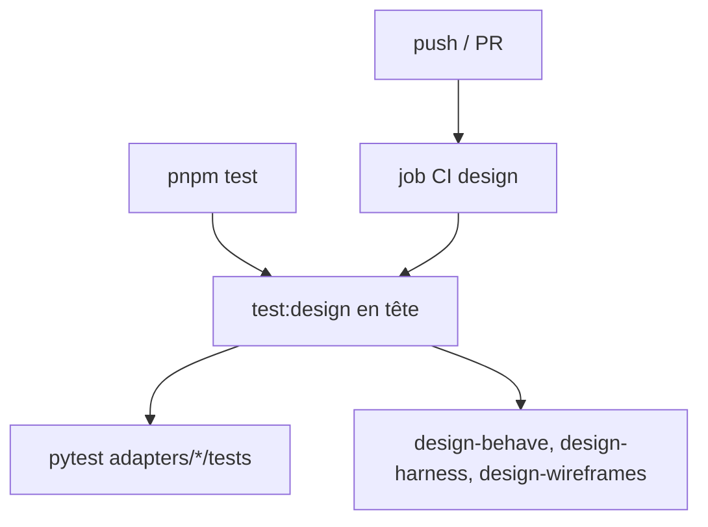

# Instruction: suites design lancées et gardées

## Architecture projection

> Tree of the final files. ✅ create · ✏️ modify · ❌ delete

```txt
.
├── package.json                                       ✏️ script test:design, placé en tête de test
├── .github/workflows/test.yml                         ✏️ job design (Python, Chromium, pnpm test:design)
├── tools/eval/
│   ├── design-pytest.mjs                              ✅ pytest sur plugins/design/adapters/*/tests
│   ├── sc-php-fse-behave.mjs                          ✏️ l'appel pytest measure en sort
│   └── design-behave.mjs                              ✏️ gardes de prose normalisées, python par plateforme, libellé structurel
└── plugins/design/
    ├── adapters/measure/requirements.txt              ✏️ pillow==12.3.0
    ├── adapters/measure/requirements-dev.txt          ✅ -r requirements.txt + pytest épinglé
    ├── adapters/measure/pixeldiff.py                  ✏️ Image.open(…, formats=["PNG"])
    ├── adapters/measure/tests/conftest.py             ✅ marker browser, skip si Playwright ou Chromium absent
    ├── adapters/measure/tests/test_cascade_ownership.py  ✏️ marqué browser
    ├── adapters/measure/tests/test_per_target_props.py   ✏️ marqué browser
    └── references/wireframe-render-setup.md           ✏️ installer requirements-dev.txt
```

## User Journey



## Tasks to do

### `1)` Lanceur pytest design

1. `tools/eval/design-pytest.mjs` : interpréteur `DESIGN_PYTHON`, sinon `python` sous win32 et `python3` ailleurs ; `-m pytest plugins/design/adapters/measure/tests plugins/design/adapters/wireframes/tests -q --basetemp <tmp>` ; `PYTHONUTF8=1` ; exit ≠ 0 → échec.
2. Retirer le bloc pytest de `sc-php-fse-behave.mjs:90-103` (constat review 5 : une eval sc-php lançait les tests design, son nom mentait sur ce qu'elle couvre).
3. Même choix d'interpréteur dans `design-behave.mjs` (`:116`, `:137`, `:170`).

### `2)` Scripts et CI

1. `package.json` : `test:design` = `design-pytest`, `design-behave`, `design-harness`, `design-wireframes` ; `test` = `pnpm test:design && <reste de la chaîne sans ces évals>` ; `sc-php-fse-behave` reste dans le reste de la chaîne (suite sc-php, pas design).
2. `test.yml` : job `design` sur ubuntu, `pnpm/action-setup` + `setup-node` 20 (le job existant n'a pas pnpm), `setup-python` 3.13, `pip install -r plugins/design/adapters/measure/requirements-dev.txt`, `python -m playwright install --with-deps chromium`, export de `WIREFRAMES_CHROMIUM` (chemin lu via Playwright), `pnpm test:design`.

### `3)` Dépendances

1. `pillow==12.3.0` ; `pixeldiff.py:26` n'ouvre que du PNG.
2. `requirements-dev.txt` avec `pytest` épinglé ; `wireframe-render-setup.md` dit de l'installer.

### `4)` Robustesse des gardes

1. `conftest.py` : marker `browser` ; skip si `playwright` n'est pas importable ou si Chromium ne se lance pas. Marquer les tests navigateur de `test_cascade_ownership.py` et `test_per_target_props.py`.
2. `design-behave.mjs:77-103` : normaliser les espaces (`.replace(/\s+/g, ' ')`) du texte lu et de l'attendu avant `includes`.
3. `design-behave.mjs:29-51` : renommer le contrôle du `## Results log` en contrôle structurel dans le code et ses messages ; la preuve comportementale reste les spawns `run-gates`.

## Test acceptance criteria

| Task | Acceptance criteria              |
| ---- | -------------------------------- |
| 1 | `node tools/eval/design-pytest.mjs` exécute les tests measure et wireframes et sort ≠ 0 si un test échoue ; `sc-php-fse-behave.mjs` ne lance plus pytest |
| 2 | `pnpm test` exécute les suites design même quand `debrief-contract` est rouge ; un push déclenche le job `design`, qui échoue si un test design échoue |
| 3 | `pip install -r requirements-dev.txt` installe pillow 12.3.0 et pytest ; `pixeldiff.py` refuse un fichier non PNG |
| 4 | Sans Playwright, les tests navigateur sont skippés, pas en erreur de collecte ; reformater `05-fidelity-gate.md` sans changer le sens ne casse pas `design-behave.mjs` |
