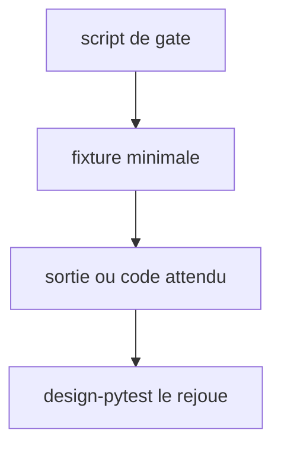

# Instruction: tests des scripts de gate non couverts

## Architecture projection

> Tree of the final files. ✅ create · ✏️ modify · ❌ delete

```txt
.
├── plugins/design/
│   ├── adapters/a11y/tests/test_contrast.py           ✅ paires connues, multi-thème, alpha, exit 3, --allow-unpaired
│   ├── adapters/measure/tests/test_pixeldiff.py       ✅ PNG identiques, diff connu
│   ├── adapters/measure/tests/test_screenshot.py      ✅ marker browser
│   ├── adapters/measure/tests/fixtures/pixeldiff/     ✅ 2-3 PNG minuscules
│   ├── tools/tests/test_generate.py                   ✅ contrat 2.x → snapshot de la sortie
│   ├── tools/tests/test_migrate_contract.py           ✅ contrat 1.x → migration → release.json valide
│   └── tools/tests/fixtures/                          ✅ contrat 1.x et 2.x minimaux + sortie attendue
└── tools/eval/design-pytest.mjs                       ✏️ ajoute adapters/a11y/tests et tools/tests
```

## User Journey



## Tasks to do

### `1)` contrast.py

1. Paires fg×bg au ratio connu (noir/blanc 21:1, `#767676`/blanc ≈ 4.54:1), deux thèmes, alpha (cas de la phase 2), exit 3 sans paire, `--allow-unpaired`.

### `2)` generate.py et migrate-contract.py

1. `generate.py` : contrat 2.x minimal → sortie comparée à un snapshot versionné.
2. `migrate-contract.py` : contrat 1.x minimal → `release.json` produit, champs requis présents, sauvegarde `.contract-1x` créée.

### `3)` pixeldiff.py et screenshot.py

1. `pixeldiff.py` : deux PNG identiques → aucun écart ; deux PNG au diff connu → le compte attendu.
2. `screenshot.py` : un rendu d'une page fixture locale, marqué `browser`.

### `4)` Lanceur

1. `design-pytest.mjs` ajoute `plugins/design/adapters/a11y/tests` et `plugins/design/tools/tests`.

## Test acceptance criteria

| Task | Acceptance criteria              |
| ---- | -------------------------------- |
| 1 | Revenir sur la correction alpha de la phase 2 fait échouer `test_contrast.py` |
| 2 | Une modification de la sortie de `generate.py` fait échouer son snapshot ; la migration d'un 1.x produit un `release.json` qui passe `run-gates.py` |
| 3 | `test_pixeldiff.py` passe sans navigateur ; `test_screenshot.py` est skippé sans Chromium et passe avec |
| 4 | `pnpm test:design` exécute les cinq nouveaux fichiers de test (`test_contrast`, `test_pixeldiff`, `test_screenshot`, `test_generate`, `test_migrate_contract`) |
