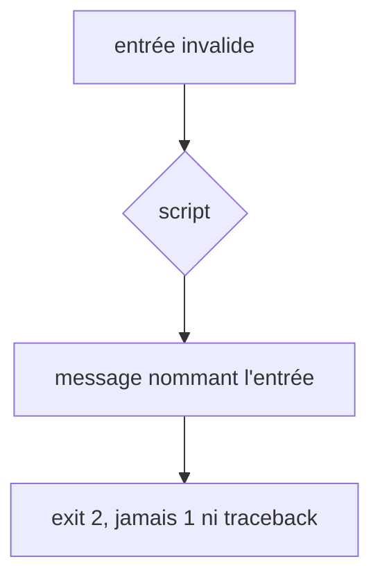

# Instruction: contrat d'entrée, exit 2 et écritures sûres

## Architecture projection

> Tree of the final files. ✅ create · ✏️ modify · ❌ delete

```txt
.
├── plugins/design/
│   ├── adapters/measure/measure.py                    ✏️ chargement de config protégé (:1058)
│   ├── adapters/measure/screenshot.py                 ✏️ chargement protégé (:92) + _resolve_url
│   ├── adapters/measure/config-gen.py                 ✏️ forme des JSON validée (:462-464, :503-517)
│   ├── adapters/measure/tests/test_invalid_input.py   ✅ config absente, JSON invalide, clé manquante, mauvais type
│   ├── tools/run-gates.py                             ✏️ un seul chemin d'erreur, (OSError, ValueError)
│   ├── skills/enforce/fixtures/dual-host/design/lint/run-gates.py  ✏️ copie identique
│   ├── tools/migrate-contract.py                      ✏️ refus si sauvegarde présente, écriture atomique
│   ├── tools/harness-runtime-check.mjs                ✏️ node:util parseArgs
│   └── tools/tests/test_migrate_contract.py           ✏️ cas sauvegarde existante
```

## User Journey



## Tasks to do

### `1)` Mesure

1. `measure.py:1058` et `screenshot.py:92` : `try/except (OSError, ValueError, KeyError)` → message + exit 2 ; valider `targets` et `breakpoints` avant tout lancement de navigateur.
2. `screenshot.py:57-75` : importer `_resolve_url` de `measure.py:406-411` au lieu de passer `reference_url` brut (chemins relatifs acceptés).
3. `config-gen.py` : garde `isinstance(dict)` sur `components.json`, `oracle.json` et leurs sous-objets → `GateError` (exit 2).

### `2)` run-gates.py

1. Un seul chemin `raise abort(...)` ; `read_json` attrape `(OSError, ValueError)`.
2. Recopier dans la fixture dual-host.

### `3)` migrate-contract.py

1. Sauvegarde `.contract-1x` déjà présente → exit 2 sans rien écrire.
2. Chaque écriture passe par un fichier temporaire + `os.replace`.

### `4)` harness-runtime-check.mjs

1. Arguments lus par `node:util parseArgs` ; `--expect-pages home f.html` prend `f.html` pour le fichier.

## Test acceptance criteria

| Task | Acceptance criteria              |
| ---- | -------------------------------- |
| 1 | Config absente, JSON invalide ou clé `targets` manquante : `measure.py` et `screenshot.py` sortent en 2 avec un message, sans traceback ; `components.json = []` fait sortir `config-gen.py` en 2 |
| 1 | `screenshot.py` accepte la même `reference_url` relative que `measure.py` |
| 2 | Un `gates.config.json` non UTF-8 fait sortir `run-gates.py` en 2 |
| 3 | Relancer la migration avec une sauvegarde présente sort en 2 et laisse la sauvegarde intacte |
| 4 | `--expect-pages home f.html` vérifie `f.html` |
