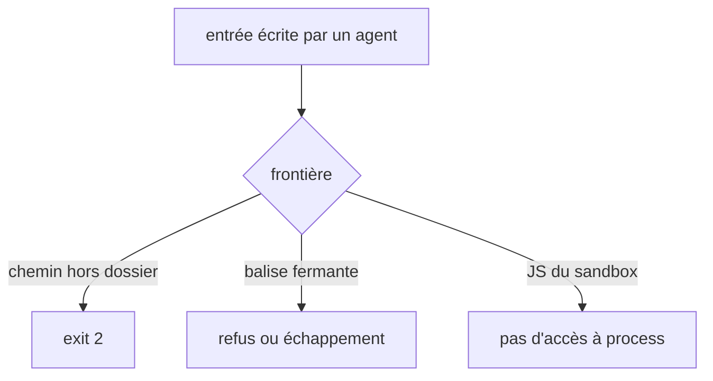

# Instruction: frontières de sécurité et gabarit wireframes

## Architecture projection

> Tree of the final files. ✅ create · ✏️ modify · ❌ delete

```txt
.
├── plugins/design/
│   ├── tools/harness-runtime-check.mjs                ✏️ aucune fonction de l'hôte dans le contexte vm, codeGeneration coupé
│   ├── tools/generate.py                              ✏️ artifact confiné sous out_dir ; thème en slug ; valeurs sans { } ; <
│   ├── tools/harness-selftest.sh                      ✏️ cas d'évasion vm
│   ├── tools/run-gates.py                             ✏️ report_path confiné sous base
│   ├── skills/enforce/fixtures/dual-host/design/lint/run-gates.py  ✏️ copie identique
│   ├── tools/harness-apply.py                         ✏️ refus de </style dans payload.styles
│   ├── adapters/wireframes/render-check.py            ✏️ sans --allow-file-access-from-files ; réseau limité au fichier
│   ├── adapters/wireframes/wireframes.py              ✏️ manifeste échappé ; lang du manifeste ; var(--paper) ; --line ≥ 3:1
│   ├── references/wireframe-manifest.schema.json      ✏️ champ lang optionnel
│   ├── adapters/wireframes/tests/                     ✏️ cas échappement, lang
│   └── tools/tests/                                   ✏️ cas confinement generate et run-gates
```

## User Journey



## Tasks to do

### `1)` Sandbox vm

1. `harness-runtime-check.mjs:124-136` : le contexte ne reçoit aucune fonction de l'hôte. Tout objet hôte expose le `Function` de l'hôte par `.constructor`, et `codeGeneration` ne s'applique pas au realm de l'hôte. Donc : retirer `String, Object, Array, JSON, Error, RegExp, Math, Set, Map, encodeURIComponent, decodeURIComponent` (le contexte a les siens) ; définir `document`, `location`, `history` et `console` par un script source évalué dans le contexte ; ne passer de l'hôte que des données (chaînes JSON) et relire les résultats en données. `vm.createContext(sandbox, { codeGeneration: { strings: false, wasm: false } })`.
2. Cas ajoutés à `harness-selftest.sh` (rejoués par `design-harness.mjs`) : `X.constructor.constructor('return process')()` ne rend pas le `process` de l'hôte pour `X` ∈ `Object`, `encodeURIComponent`, `console.log`, `history.replaceState`, `document.querySelector`.
3. Risque résiduel consigné dans le CHANGELOG : `node:vm` n'est pas une frontière de sécurité (doc Node) ; le correctif ferme les évasions connues par objet hôte, pas davantage.

### `2)` Chemins confinés

1. `generate.py:412` (et `check_all`, `:443`) : `resolve()` puis `relative_to(out_dir.resolve())`, sinon exit 2 — même garde que `harness.py:646-651`.
2. `run-gates.py:248-256` : `report_path` confiné sous `base`, sinon exit 2 ; recopié dans la fixture dual-host.

### `3)` Injections dans le HTML et le CSS

1. `wireframes.py:180` : `<`, `>` et `&` du manifeste JSON remplacés par leurs échappements JSON, comme `js_literal` (`harness.py:161`).
2. `harness-apply.py:105` : refus de `</\s*style` dans `payload.styles`, comme `raw_script` (`:35`).
3. `generate.py:217-228` : noms de thème en slug ; `{`, `}`, `;` et `<` refusés dans les valeurs scalaires → exit 2.

### `4)` Chromium de render-check

1. Retirer `--allow-file-access-from-files` (la planche ne lit aucun fichier voisin par script) et `--no-sandbox` (redondant : Playwright le passe déjà, `chromium_sandbox=False` par défaut). La protection réelle est `page.route("**/*")`, qui rejette toute requête hors du fichier cible et de ses assets locaux ; le CHANGELOG ne revendique pas de sandbox Chromium.

### `5)` Gabarit wireframes

1. Champ `lang` optionnel au schéma du manifeste (défaut `fr`), échappé et injecté dans `<html lang>`.
2. `.wireframe-frame` : `background: var(--paper)`.
3. `--line` assombri jusqu'à un contraste ≥ 3:1 sur `--paper`.

## Test acceptance criteria

| Task | Acceptance criteria              |
| ---- | -------------------------------- |
| 1 | Aucun des cinq scripts d'évasion ne récupère `process` ; les checks runtime existants passent |
| 2 | `artifact: "../x.css"` ou un chemin absolu fait sortir `generate.py` en 2 sans rien écrire ; même chose pour `report_path` dans `run-gates.py` |
| 3 | Un `title` contenant `</script><script>` reste dans le bloc JSON et `render-check.py` parse le manifeste ; `</style>` dans `styles` est refusé ; un thème nommé `a"b` sort en 2 |
| 4 | `render-check.py` passe ses tests sans `--allow-file-access-from-files` ; une requête réseau externe de la planche est bloquée |
| 5 | `lang: "en"` produit `<html lang="en">` ; `--line` sur `--paper` mesure ≥ 3:1 |
