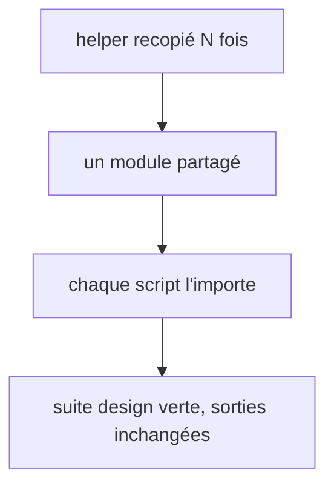

# Instruction: helpers partagés

## Architecture projection

> Tree of the final files. ✅ create · ✏️ modify · ❌ delete

```txt
.
├── tools/eval/design-behave.mjs                       ✏️ garde : le trio copié n'importe pas _common
└── plugins/design/
    ├── tools/_common.py                               ✅ fail, shape_of, fail_shape, sha256, read_json typé, atomic_write
    ├── tools/wireframes_common.py                     ✅ green(), targets_artifact(), hash unique
    ├── adapters/_shared/colors.py                     ✅ parseur de couleur (hex, rgb(), color(srgb), nommées) + alias {a.b}
    ├── tools/generate.py                              ✏️ importe _common et colors
    ├── tools/migrate-contract.py                      ✏️ migrate découpé (n'importe pas _common : copié seul)
    ├── tools/harness-apply.py                         ✏️ read_json de _common
    ├── tools/wireframes-{handoff,review,apply,analyze}.py  ✏️ importent wireframes_common / atomic_write
    ├── adapters/harness/harness.py                    ✏️ read_json de _common
    ├── adapters/a11y/contrast.py                      ✏️ importe colors
    └── adapters/measure/measure.py                    ✏️ importe colors ; constantes de temps ; code redondant retiré ; COLOR_PROPS complété
```

## User Journey



## Tasks to do

### `1)` Modules communs

1. `tools/_common.py` : reprendre `fail`, `shape_of`, `fail_shape`, `sha256` de `generate.py:54-93` ; un `read_json` à contrat unique (absent → `None`, illisible → erreur exit 2) ; `atomic_write` (tmp + `os.replace`, même technique que la phase 5 dans `migrate-contract.py`, qui garde la sienne).
2. `tools/wireframes_common.py` : `green()` et `targets_artifact()` de `wireframes-handoff.py:29-35` ; un seul nom pour le hash.
3. `adapters/_shared/colors.py` : le parseur de `measure.py:474-566` et une résolution d'alias `{a.b}` unique ; `contrast.py` accepte alors `rgb(...)`. Les scripts à tiret s'importent par ajout du dossier à `sys.path`, comme le font déjà les tests.
4. Remplacer chaque copie par l'import, sauf dans `run-gates.py`, `status.py` et `migrate-contract.py` (trio copié seul dans `design/lint/`, voir Decisions) ; `design-behave.mjs` échoue si l'un des trois importe `_common`.

### `2)` Découpage et nettoyage

1. `migrate-contract.py:241` : `migrate` découpé en `validate`, `build_release`, `render_report`, `write`.
2. `measure.py` : constantes `NAV_TIMEOUT_MS`, `SETTLE_MS` (aussi dans `screenshot.py` et `render-check.py`) ; supprimer la double affectation `cov["ok"]` (`:916-918`) et la branche `scale` identique (`:526-528`) ; `config-gen.py:370` : retirer la condition morte.
3. `COLOR_PROPS` (`measure.py:417-420`) : ajouter `borderRightColor`, `borderBottomColor`, `borderLeftColor`, `fill`, `stroke`, avec un test.

## Test acceptance criteria

| Task | Acceptance criteria              |
| ---- | -------------------------------- |
| 1 | Hors du trio copié, aucune définition de `fail`, `sha256`, `atomic_write`, `green` ou de parseur de couleur n'existe en double sous `plugins/design/` ; la fixture dual-host passe toujours `run-gates.py` ; `contrast.py` accepte un token `rgb(0 0 0)` |
| 1 | `pnpm test:design` passe, snapshots de la phase 4 inchangés |
| 2 | `migrate` ne dépasse pas 40 lignes ; aucun `timeout=20000` ni `wait_for_timeout(<nombre>)` littéral dans `adapters/measure` |
| 2 | Un écart sur `borderLeftColor` produit une ligne de mesure |
