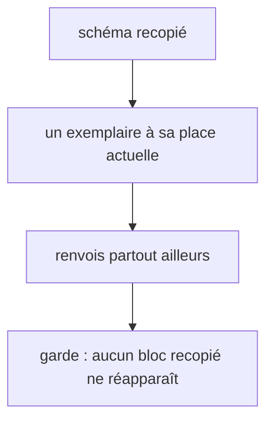

# Instruction: une source par schéma et carte juste

## Architecture projection

> Tree of the final files. ✅ create · ✏️ modify · ❌ delete

```txt
.
├── aidd_docs/memory/design-plugin.md                  ✏️ chemin de lint-core.mjs (:214)
├── tools/eval/design-behave.mjs                       ✏️ gardes sur les renvois et le README measure
└── plugins/design/
    ├── references/contract-schema.md                  ✏️ blocs components et oracle remplacés par des renvois
    ├── references/gate-natures.md                     ✏️ énoncé unique « brief seul = pas de gate de fidélité »
    ├── adapters/measure/README.md                     ✅ venv, requirements(-dev), playwright install, modes A/B
    ├── agents/copycat.md                              ✏️ chargé par define et enforce (:25) ; renvoi gate-natures
    ├── skills/define/actions/{03-construct,05-copycat-fanout}.md  ✏️ renvois gate-natures et README
    ├── skills/enforce/actions/05-fidelity-gate.md     ✏️ renvois gate-natures et README
    ├── skills/diffuse/actions/02-render.md            ✏️ renvoi gate-natures
    └── references/visual-diff-procedure.md            ✏️ renvoi gate-natures
```

## User Journey



## Tasks to do

### `1)` Schémas uniques

1. `manifest-schema.md` reste dans `skills/adjust/references/` (cité par les design-bridge de `sc-css`, `sc-js`, `sc-php` ; voir Decisions).
2. `contract-schema.md:152-166` : bloc `components.json` remplacé par un renvoi à `skills/adjust/references/manifest-schema.md` (qui porte `states`).
3. `contract-schema.md:225-256` : bloc `oracle.json` remplacé par un renvoi à `adjust/actions/02-freeze.md`, qui le fige.

### `2)` Renvois entre actions

1. Énoncer une seule fois dans `references/gate-natures.md` la limite « brief seul = pas de gate de fidélité ».
2. `define/03-construct.md:46`, `enforce/05-fidelity-gate.md:148,170`, `copycat.md:38`, `visual-diff-procedure.md:7`, `diffuse/02-render.md:77` renvoient à `gate-natures.md`, plus à une section d'une autre action.

### `3)` Docs manquantes et incohérences

1. Créer `adapters/measure/README.md` ; `05-fidelity-gate.md:27` et `define/actions/05-copycat-fanout.md:14` y renvoient.
2. `copycat.md:25` : chargé par `define` et `enforce` ; `design-plugin.md:214` : `skills/enforce/adapters/lint-core.mjs`.

### `4)` Gardes

1. `design-behave.mjs` : échec si `contract-schema.md` contient de nouveau un bloc JSON `components` ou `oracle`, ou si `adapters/measure/README.md` manque.

## Test acceptance criteria

| Task | Acceptance criteria              |
| ---- | -------------------------------- |
| 1 | Un seul exemplaire des schémas `components.json` et `oracle.json` sous `plugins/design/` ; les renvois de `contract-schema.md` se résolvent |
| 2 | Aucune action d'une skill ne renvoie à une section d'une action d'une autre skill pour la limite « brief seul » |
| 3 | `05-fidelity-gate.md:27` renvoie à un fichier qui existe |
| 4 | Remettre un bloc JSON `components` dans `contract-schema.md` fait échouer `design-behave.mjs` ; tous les liens relatifs se résolvent |
