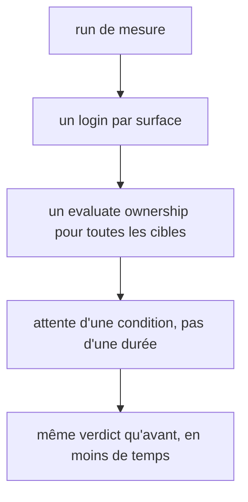

# Instruction: mesure plus rapide

## Architecture projection

> Tree of the final files. ✅ create · ✏️ modify · ❌ delete

```txt
.
└── plugins/design/
    ├── adapters/measure/measure.py                    ✏️ ownership en un evaluate ; login réutilisé ; attentes conditionnelles
    ├── adapters/measure/config-gen.py                 ✏️ classes lues par un findall par sélecteur
    ├── adapters/wireframes/render-check.py            ✏️ lint statique importé, plus un sous-processus
    ├── skills/enforce/adapters/lint-core.mjs          ✏️ plusieurs fichiers par appel ; une fonction par règle
    ├── skills/enforce/fixtures/dual-host/design/lint/lint-core.mjs  ✏️ copie identique
    ├── skills/enforce/fixtures/dual-host/design/lint/run-gates.py  ✏️ copie identique
    └── tools/run-gates.py                             ✏️ un seul spawn node par run
```

## User Journey



## Tasks to do

### `1)` measure.py

1. `_OWNERSHIP` : un seul `evaluate` reçoit toutes les cibles, parcourt le CSSOM une fois et renvoie un résultat par cible (`:672-676`, `:276`).
2. Login une fois par surface, puis `ctx.storage_state()` réutilisé pour chaque breakpoint (`:636-660`).
3. Côté implémentation : une page par surface, `set_viewport_size` par breakpoint ; côté maquette, le rechargement reste (`_ISOLATE_FRAME`).
4. `wait_for_timeout` fixes remplacés par `wait_for_function` ou `wait_for_load_state` là où une condition existe ; `SETTLE_MS` seulement là où aucune ne l'est.

### `2)` lint-core et run-gates

1. `lint-core.mjs` accepte plusieurs fichiers et sort un JSON par fichier ; avec un seul fichier, la sortie et le code de sortie restent identiques à aujourd'hui ; les artefacts du contrat sont lus une fois ; une fonction par règle (`:382-477`). Copie dual-host identique.
2. `run-gates.py:198-202` : un seul appel `node` pour toutes les cibles markup ; copie dual-host identique.

### `3)` Petits gains

1. `config-gen.py:348-354` : un `re.findall(r"\.([\w-]+)")` par sélecteur, puis une intersection d'ensembles.
2. `render-check.py:21-23` : importer `wireframes-lint` par `importlib`.

### `4)` Référence de temps

1. Chronométrer un run `measure.py` sur la fixture de `test_per_target_props.py` avant et après ; consigner les deux durées dans le message de commit.

## Test acceptance criteria

| Task | Acceptance criteria              |
| ---- | -------------------------------- |
| 1 | Les tests `adapters/measure/tests` passent sans changement d'attendu ; le verdict et les lignes de mesure des fixtures sont identiques à avant |
| 1 | Le run chronométré est plus court qu'avant |
| 2 | `run-gates.py` lance `node` une fois par run ; les fixtures `enforce` rendent les mêmes verdicts ; les copies dual-host de `lint-core.mjs` et `run-gates.py` restent identiques ; un appel mono-fichier rend la même sortie qu'avant |
| 3 | `config-gen.py` produit des configs identiques sur les fixtures ; `render-check.py` ne lance plus de sous-processus Python |
