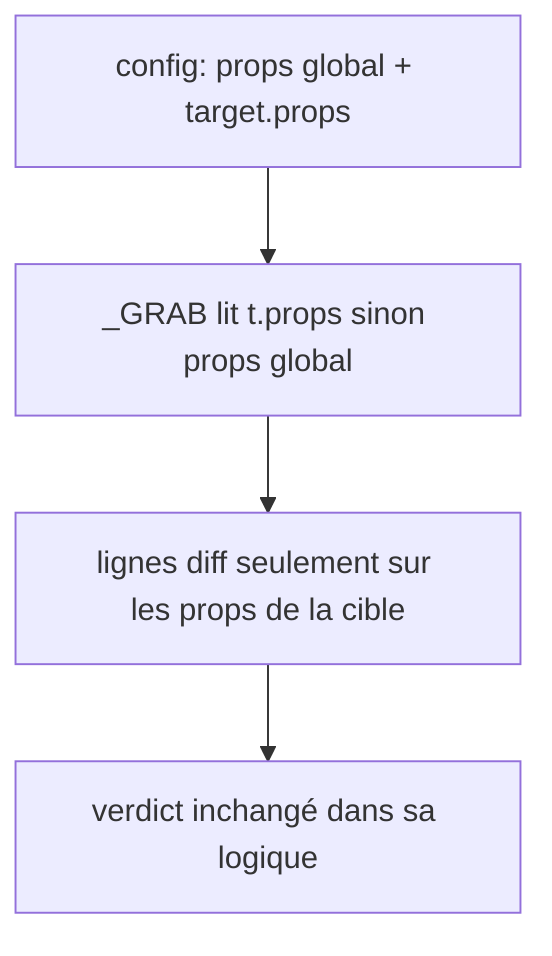

# Instruction: measure.py lit les props par cible

## Architecture projection

> Tree of the final files. ✅ create · ✏️ modify · ❌ delete

```txt
plugins/design/adapters/measure/
├── measure.py                         ✏️ props par cible (repli global), docstring config
├── configs/example.json               ✏️ une cible avec props propres
│   (racine) tools/eval/sc-php-fse-behave.mjs  ✏️ pytest sur tout adapters/measure/tests
└── tests/
    ├── fixtures/per-target-props/     ✅ mockup.html + impl.html + config.json + deviations.json
    └── test_per_target_props.py       ✅ régression Chromium sur fixture file://
```

## User Journey



## Tasks to do

### `1)` Props effectives par cible

> Une cible qui déclare `props` n'est mesurée que sur ces props ; sinon la liste globale s'applique.

1. `_GRAB` (`measure.py:157-172`) : `const ps = t.props || props`.
2. Boucle de lignes Mode B (`measure.py:728`) : itérer sur `t.get("props") or props`.
3. `cfg["props"]` devient optionnel si toutes les cibles portent `props` ; sinon absence = exit 2 nommant les cibles sans props.
4. Docstring config (`measure.py:40-50`) : documenter `targets[].props` et la règle de repli.

### `2)` Régression

> Prouver la lecture par cible sans réseau.

1. Fixture HTML locale : une cible avec `props: ["display","gridTemplateColumns"]` divergente sur ces props, identique sur `fontSize`.
2. Test : le rapport ne contient que les props de la cible ; une cible sans `props` reçoit la liste globale.
3. Mettre à jour `configs/example.json`.
4. Brancher les tests pytest de `adapters/measure/tests/` dans `pnpm test` (même mécanisme que `sc-php-fse-behave.mjs:95`, sur tout le dossier), pour que les phases 1 et 2 soient gardées par défaut.

## Test acceptance criteria

| Task | Acceptance criteria              |
| ---- | -------------------------------- |
| 1 | Une cible avec `props` produit exactement une ligne par prop déclarée et par breakpoint, aucune pour la liste globale |
| 1 | Une cible sans `props` produit les lignes de la liste globale, comme avant |
| 1 | Config sans `props` global et avec une cible sans `props` : exit 2, message nommant la cible |
| 2 | `pytest adapters/measure/tests` passe, anciens tests compris |
| 2 | `pnpm test` exécute tout `adapters/measure/tests` et échoue si un test échoue |
