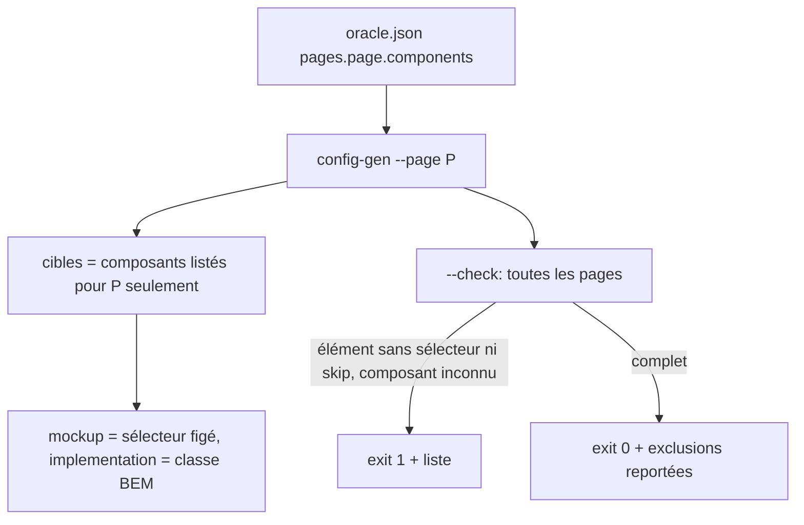

# Instruction: schéma oracle `pages` + config-gen par page

## Architecture projection

> Tree of the final files. ✅ create · ✏️ modify · ❌ delete

```txt
plugins/design/
├── references/contract-schema.md            ✏️ § oracle.json : pages, props racine, skip, statut requis
├── docs/concepts.md                         ✏️ ligne oracle.json : requis si référence mesurable
├── skills/enforce/adapters/lint-core.mjs    ✏️ commentaire :224 aligné (lint ne lit toujours pas oracle)
├── skills/adjust/actions/02-freeze.md       ✏️ bloc JSON oracle.json aligné
├── adapters/measure/
│   ├── config-gen.py                        ✏️ --page filtre, sélecteur maquette, props racine, --check
│   └── tests/
│       ├── fixtures/contract-pages/         ✅ components/tokens/oracle avec 2 pages
│       └── test_config_gen_pages.py         ✅ génération + --check
```

## User Journey



## Tasks to do

### `1)` Schéma `pages`

> `oracle.json` porte, par page de référence, les composants présents et le sélecteur maquette de chaque élément.

1. Ajouter à `contract-schema.md § oracle.json` :
   `pages.<page-key>.components.<canonical>.{ root: <sel>, elements: { <label>: <sel> | { "skip": "<raison>" } }, collections: { <name>: <item sel> } }`.
2. Documenter `components.<name>.props` (racine) pour les props de mise en page, et `elements.<label>.props` = remplacement (déjà écrit ligne 246, à garder).
3. Règle : un contrat à référence mesurable écrit `oracle.json` avec `pages` (le fichier cesse d'être optionnel dans ce cas) ; clés = clés `setPage` du harness, c'est-à-dire la valeur de `reference_page` que `--page` pose déjà.
4. Aligner le bloc JSON de `02-freeze.md:84-93`, `docs/concepts.md:38` et le commentaire `lint-core.mjs:224`.

### `2)` config-gen par page

> La config générée ne contient que la page demandée, avec ses deux sélecteurs.

1. `--page` + `pages` présent : ne dériver que les composants de `pages[page]` ; page inconnue = exit 2.
2. `mockup` = sélecteur figé ; `implementation` = classe BEM (`_dot_selector`) ; `skip` = cible omise et listée dans `_excluded`.
3. Cible racine : porter `oracle.components.<c>.props` si déclaré.
4. Collections : `mockup` depuis `pages[page]...collections`, `implementation` depuis `item_selector`.
5. Ownership targets (`--ownership-stylesheet`) : filtrées sur les mêmes composants de la page.
6. Sans `pages` : comportement actuel conservé (contrats 2.x existants), avec avertissement sur stderr.
7. CLI : `--implementation-url` devient optionnel (absent = config valable pour Mode A `--side mockup` seulement, utilisé au gel) ; `--reference-url` et `--out` ne sont requis que hors `--check`.
8. Message final (`config-gen.py:377-378`) : ne plus inviter à « surcharger le champ 'mockup' » à la main ; renvoyer à `oracle.pages` via `adjust`.

### `3)` Mode `--check`

> Vérification statique du gate, sans URL ni navigateur.

1. `config-gen.py --check --components … --tokens … [--oracle …]` : parcourt toutes les pages.
2. Défauts, par composant présent sur la page : composant inconnu de `components.json`, racine sans sélecteur, élément de `components.<c>.elements` sans sélecteur ni `skip`, collection de `oracle.components.<c>.collections` sans sélecteur maquette ; et page sans composant.
3. Rapport : défauts, exclusions (`skip` + raison), composants présents sur aucune page. Exit 0 complet, 1 défauts, 2 entrée invalide.
4. Bannières console en ASCII (piège cp1252).

## Test acceptance criteria

| Task | Acceptance criteria              |
| ---- | -------------------------------- |
| 1 | `contract-schema.md` décrit `pages`, `root`, `skip`, props racine ; le bloc de `02-freeze.md` est identique |
| 2 | Sur la fixture, `--page a` ne produit aucune cible d'un composant absent de la page `a` |
| 2 | Chaque cible générée a `mockup` ≠ `implementation` quand le sélecteur figé diffère de la classe BEM |
| 2 | Un oracle sans `pages` génère la même config qu'avant (diff vide sur la fixture existante) |
| 2 | Avec `--page a`, les ownership targets ne portent que les composants de `a` |
| 3 | Une collection sans sélecteur maquette est un défaut nommé |
| 2 | `config-gen.py --page a` sans `--implementation-url` produit une config que `measure.py --mode A --side mockup` exécute |
| 3 | `config-gen.py --check` tourne sans `--reference-url` ni `--out` |
| 3 | Fixture incomplète : exit 1, chaque élément manquant nommé `page / composant / label` |
| 3 | Fixture complète avec un `skip` : exit 0, l'exclusion et sa raison apparaissent dans le rapport |
