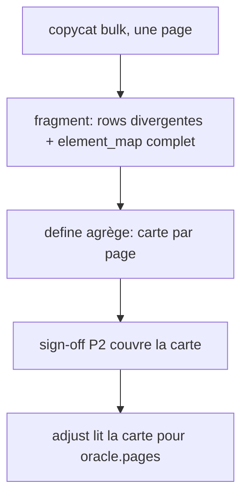

# Instruction: carte des éléments dans la table de define

## Architecture projection

> Tree of the final files. ✅ create · ✏️ modify · ❌ delete

```txt
plugins/design/
├── agents/copycat.md                              ✏️ Outputs : element_map complet
├── references/correspondence-table-template.md    ✏️ section « Carte des éléments » par page
├── skills/define/actions/05-copycat-fanout.md     ✏️ agrégation de la carte, sign-off
└── (racine) tools/eval/design-behave.mjs          ✏️ assertions sur la carte
```

## User Journey



## Tasks to do

### `1)` Fragment copycat

> Le fragment liste tous les éléments mesurés, pas seulement ceux qui divergent.

1. `copycat.md § Outputs` : ajouter `element_map: [{ component, element, mockup_selector, collection? }]` couvrant chaque cible de sa config bulk (§ Method 3, « Every candidate section gets at least one target »).
2. `element` = libellé de `components.<c>.elements` candidat, ou `root`.

### `2)` Table et agrégation

> La table signée porte la carte, source unique des sélecteurs maquette.

1. Template : en-tête avec l'URL de la maquette mesurée ; section « Carte des éléments » par clé de page `setPage` (composant, élément, sélecteur maquette), distincte des lignes divergentes. Les libellés sont ceux du brouillon : `adjust` les rapproche des noms canoniques.
2. `05-copycat-fanout.md` étape C : fusionner les cartes par page ; un même élément avec deux sélecteurs sur une page = conflit remonté, pas tranché.
3. Case de sign-off : « Carte des éléments revue ».

### `3)` Garde comportementale

1. `design-behave.mjs` : exiger `element_map` dans `copycat.md` et la section dans le template.

## Test acceptance criteria

| Task | Acceptance criteria              |
| ---- | -------------------------------- |
| 1 | `copycat.md § Outputs` impose une entrée `element_map` par cible mesurée, divergente ou non |
| 2 | Le template porte la section « Carte des éléments » et sa case de sign-off |
| 2 | Deux sélecteurs pour un même élément d'une page apparaissent en Conflicts |
| 3 | `pnpm test` passe et échoue si `element_map` est retiré de `copycat.md` |
