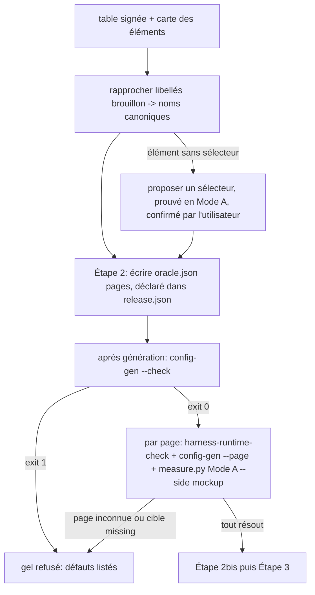

# Instruction: adjust fige et vérifie le gate

## Architecture projection

> Tree of the final files. ✅ create · ✏️ modify · ❌ delete

```txt
plugins/design/skills/adjust/
├── actions/02-freeze.md          ✏️ oracle.pages écrit à l'Étape 2, étape « Prouver le gate », test de validité, sortie
├── SKILL.md                      ✏️ règle transversale : pas de gel sur gate incomplet
└── evals/scenarios.json          ✏️ scénarios gel bloqué / gel avec skip / maquette-image / renommage
```

## User Journey



## Tasks to do

### `1)` Étape de gel

> Le gate est écrit à l'Étape 2 avec les autres artefacts, puis prouvé côté maquette avant de marquer la charte figée.

1. Portée : l'étape s'applique quand la référence est **mesurable** (maquette servie avec DOM, harness `setPage`). Brief seul ou maquette-image seule : étape sans objet, dit explicitement dans la sortie, et `release.json` ne déclare pas de gate de fidélité.
2. Rapprochement (Étape 2, avant `release.json`) : chaque entrée de la carte signée est rattachée au nom canonique `components.json` et au libellé d'élément final. Entrée orpheline (composant supprimé ou fusionné) = listée, pas écrite.
3. Élément canonique sans sélecteur dans la carte : `adjust` propose un sélecteur maquette, le prouve en Mode A, et le soumet à l'utilisateur avec les autres décisions de gel ; sinon `skip` avec raison. Aucun sélecteur n'entre dans `oracle.json` sans cette preuve.
4. Écrire `oracle.json § pages` à l'Étape 2 et le déclarer dans `release.json § artifacts`.
5. Nouvelle sous-étape « Prouver le gate de fidélité », après « Générer les artefacts dérivés » et avant « Étape 2bis » :
   - `config-gen.py --check` ; exit 1 = refus de figer, défauts rapportés tels quels ;
   - une fois : `harness-runtime-check.mjs <fichier maquette> --expect-pages <toutes les clés>` quand la maquette est un fichier harness local ; servie par URL, une clé inconnue se révèle par des cibles `missing` au pas suivant ;
   - pour chaque clé de `pages` : `config-gen.py --page <clé> --reference-url <maquette>` (sans `--implementation-url`) et `measure.py --mode A --side mockup --ledger-registry design/deviations.json` (registre non lu en Mode A) ; toute ligne `missing` = refus de figer.
6. Référence mesurable sans carte signée = refus de figer, renvoi à `define`.
7. URL de la maquette : celle de l'en-tête de la table de correspondance signée (phase 3).

### `2)` Contrat de sortie

1. Test de validité : ajouter les cases `--check` exit 0 et zéro `missing` côté maquette.
2. Sortie : ligne `oracle.json` avec pages, cibles, exclusions, sélecteurs proposés par `adjust`, entrées orphelines, composants présents sur aucune page.
3. `SKILL.md` : règle « Ne jamais figer un contrat à référence mesurable dont le gate de fidélité est incomplet ».

### `3)` Evals

1. Scénarios : carte incomplète sans proposition → refus ; `skip` justifié → gel ; brief ou maquette-image → étape sans objet ; composant renommé par `destructure` → rapproché, pas refusé.

## Test acceptance criteria

| Task | Acceptance criteria              |
| ---- | -------------------------------- |
| 1 | `02-freeze.md` interdit de passer à l'Étape 3 tant que `--check` ≠ 0, qu'une clé de page est absente du harness ou qu'une cible maquette est `missing` |
| 1 | `oracle.json` est écrit avant `release.json` et y est déclaré |
| 1 | Les chemins brief-seul et maquette-image ne déclenchent ni `--check` ni mesure, et le disent |
| 1 | Un sélecteur hors carte n'entre dans `oracle.json` qu'avec une preuve Mode A et la confirmation de l'utilisateur |
| 2 | La sortie de gel nomme les composants présents sur aucune page |
| 3 | `pnpm test` passe avec les nouveaux scénarios `adjust` |
