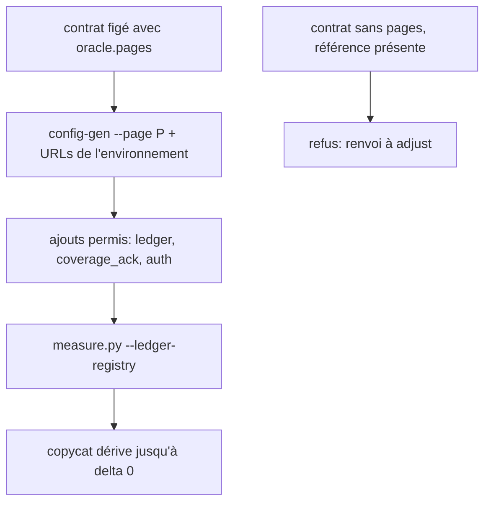

# Instruction: enforce applique le gate figé

## Architecture projection

> Tree of the final files. ✅ create · ✏️ modify · ❌ delete

```txt
plugins/design/
├── skills/enforce/actions/05-fidelity-gate.md   ✏️ config dérivée du contrat, plus de « compléter »
├── references/gate-natures.md                   ✏️ « non mappé » = défaut de gel, plus une limite
├── agents/copycat.md                            ✏️ mode dérive : mapping généré, plus de surcharge de sélecteur
├── (racine) tools/eval/design-behave.mjs        ✏️ garde contre la surcharge en dérive
└── skills/enforce/evals/scenarios.json          ✏️ refus sur contrat sans pages
```

## User Journey



## Tasks to do

### `1)` Gate appliqué

> enforce n'édite jamais les cibles, sélecteurs ou props ; il n'ajoute que l'environnement.

1. `05-fidelity-gate.md § Prérequis` et `§ Refus` : config = `config-gen.py --page` sur le contrat figé ; retirer « le compléter ».
2. Liste fermée des ajouts : URLs, `ownership` auth (env), `ledger` (ids de `deviations.json`), `coverage_ack`.
3. Contrat à référence mesurable sans `oracle.pages` : refus, renvoi à `adjust` (état distinct du vert et du rouge). Contrat sans référence mesurable : fidélité sans objet, dit explicitement.
4. Une cible `missing` côté implémentation reste une dérive à corriger, pas une cible à retirer.

### `2)` Nature du gate

1. `gate-natures.md` : « tout élément non mappé » passe de limite admise à défaut refusé au gel ; seules les exclusions `skip` restent hors mesure, et sont nommées.

### `3)` copycat dérive

1. `copycat.md § Inputs` (:97) : en dérive, le mapping sélecteurs vient de `config-gen.py --page`, jamais fourni ni écrit à la main.
2. `copycat.md § Method` (:148-152) : retirer « override the `mockup` or `implementation` field ». Cible `missing` côté maquette = défaut du contrat, remonté à `adjust` (boucle `enforce`→`adjust` déjà permise en dérive, :46). Cible `missing` côté implémentation = markup à corriger vers la classe de `components.json`.
3. Cibles supplémentaires propres à la page : permises en ajout, jamais en remplacement ni en retrait d'une cible générée ; signalées comme candidates à `oracle.pages`.
4. §10 (réconciliation config ↔ markup) : en dérive, on corrige le markup ; la config n'est régénérée que depuis le contrat.

## Test acceptance criteria

| Task | Acceptance criteria              |
| ---- | -------------------------------- |
| 1 | `05-fidelity-gate.md` ne contient plus d'instruction de compléter cibles, sélecteurs ou props |
| 1 | Scénario : référence présente, `oracle.json` sans `pages` → refus nommant `adjust` |
| 2 | `gate-natures.md` et `05-fidelity-gate.md` décrivent la même règle, sans contradiction |
| 3 | `copycat.md` n'autorise plus, en dérive, la surcharge d'un champ `mockup` ou `implementation` ni le retrait d'une cible générée |
| 3 | `pnpm test` passe, et `design-behave.mjs` échoue si la surcharge de sélecteur réapparaît |
