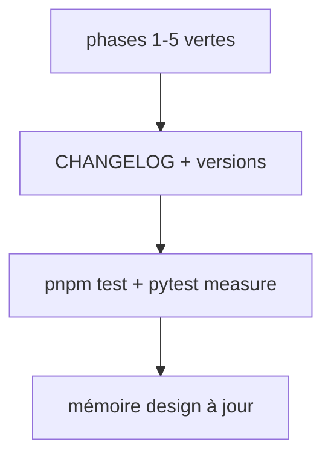

# Instruction: release design 2.17.0

## Architecture projection

> Tree of the final files. ✅ create · ✏️ modify · ❌ delete

```txt
.
├── .claude-plugin/marketplace.json            ✏️ design 2.17.0
├── aidd_docs/memory/design-plugin.md          ✏️ section gate figé par adjust
└── plugins/design/
    ├── .claude-plugin/plugin.json             ✏️ 2.17.0
    ├── .codex-plugin/plugin.json              ✏️ 2.17.0+codex.<horodatage>
    ├── skills/{adjust,define,enforce}/SKILL.md ✏️ version: bump mineur
    └── CHANGELOG.md                           ✏️ [2.17.0]
```

## User Journey



## Tasks to do

### `1)` Versions et journal

1. Bump minor 2.16.0 → 2.17.0 aux trois emplacements (le contrôle M1 de `consistency.mjs` exige l'identité Claude/marketplace/Codex). Bump mineur du champ `version:` des skills touchés : `adjust` 2.13.1 → 2.14.0, `define` 2.13.1 → 2.14.0, `enforce` 2.14.0 → 2.15.0.
2. CHANGELOG : Added (`oracle.pages`, `--check`, gel bloquant, carte des éléments), Changed (`props` par cible, enforce sans complétion), migration : un contrat à référence sans `pages` est refusé par enforce jusqu'au re-gel ; les `props` d'élément déjà présentes dans un `oracle.json`, ignorées jusqu'ici, s'appliquent désormais et peuvent changer un verdict.

### `2)` Mémoire

1. `design-plugin.md` : version courante, invariant « le gate est figé par adjust », rappel qu'un bump ne met pas à jour le cache installé.

## Test acceptance criteria

| Task | Acceptance criteria              |
| ---- | -------------------------------- |
| 1 | Les trois fichiers de version portent 2.17.0 ; le CHANGELOG décrit la migration |
| 1 | `pnpm test` et `pytest plugins/design/adapters/measure/tests` passent |
| 2 | La mémoire nomme la version 2.17.0 et le nouvel invariant |
