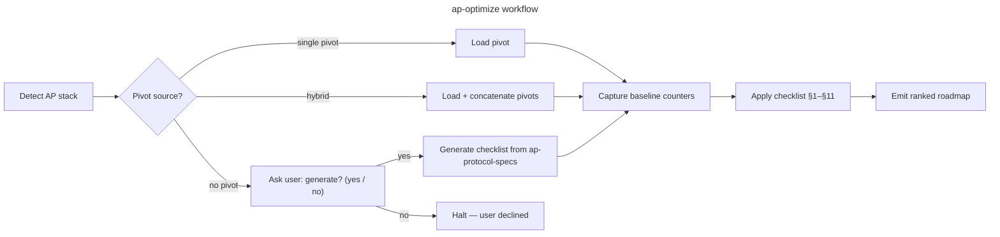

# ap-optimize

## Goal

Run a structured ActivityPub federation audit on a project — covering inbox processing, outbound delivery, protocol conformance, security, and observability — picking the right checklist for the detected stack, and emit an actionable roadmap.

## Rules

- Detect the AP stack BEFORE picking a checklist — never assume Django/Rails/Go
- **After detecting the stack, look for installed pivot rules** at `.claude/rules/07-quality/ap-pivots-<stack>.md` (provided by `sc-*` plugins: sc-python, sc-php, sc-js, sc-rust). If found → load as the primary source for §1–§11. If not found → fall back to `references/ap-protocol-specs.md` + generic 11-section schema. For hybrid stacks, load every matching `ap-pivots-*.md` and concatenate
- Capture a baseline (inbox request count, delivery queue depth, ProcessedActivity count, signature verify latency) BEFORE recommending changes — without baseline, gains are unfalsifiable
- If no pivot matches the detected stack, **propose** generating one — never silently fall back to a stack-mismatched checklist
- Recommend changes only after reading at least these 3 files: (a) inbox view, (b) signature verification module, (c) delivery task. Generic advice without this evidence is rejected
- One row per checklist item, with `🟢 / 🟡 / 🔴 / N/A` + `file:line` references when actionable
- Output goes to `aidd_docs/tasks/audits/<yyyy_mm_dd>_ap-<stack>-<scope-slug>.md`. If `aidd_docs/` does not exist, fallback to `docs/ap-audits/<yyyy_mm_dd>_ap-<stack>-<scope-slug>.md` (create dir if needed)
- If a same-day rerun produces a new file for the same scope, list existing files in the output directory first, find the highest existing suffix (`-v2`, `-v3`…), then append the next one — never attempt to write without checking existence first
- **Primary deterministic metrics**: inbox duplicate rate (`ProcessedActivity` / total inbox POSTs), delivery success rate, queue depth. Latency is secondary
- Cross-check every finding against `references/ap-protocol-specs.md` — a recommendation without spec anchor is rejected

## Quick Start

```bash
# 1. Detect the AP stack
ls */activitypub/ 2>/dev/null && echo "Django activitypub app detected"
grep -r "activitypub\|ActivityPub\|inbox\|outbox" pyproject.toml composer.json Gemfile Cargo.toml 2>/dev/null | head -10
grep -rn "httpx\|requests\|faraday\|httparty\|reqwest" . --include="*.py" --include="*.rb" --include="*.rs" -l 2>/dev/null | head -5

# 2. Baseline counters
python manage.py shell -c "from activitypub.models import ProcessedActivity; print(ProcessedActivity.objects.count())"
# Celery queue depth
redis-cli LLEN celery

# 3. Detect idempotency guard
grep -rn "ProcessedActivity" . --include="*.py" | head -10

# 4. Detect synchronous delivery (anti-pattern)
grep -rn "httpx\.\|requests\." . --include="*.py" | grep -v "await\|task\|celery\|delay"

# 5. Detect actor fetch without cache
grep -rn "fetch_actor\|get_actor" . --include="*.py" | grep -v "cache"
```

## Workflow



### Step 1: Detect AP stack

**Do:**

1. Read manifests: `pyproject.toml`, `Gemfile`, `composer.json`, `Cargo.toml`, `package.json`
2. Look for tell-tale signals:
   - **Django**: `activitypub/` app directory + `httpx` + `cryptography` in deps
   - **Rails**: `activitypub` gem OR custom `app/lib/activitypub/`
   - **Go**: `go-ap` or `gofed` imports
   - **PHP**: `activitypub` composer package OR custom namespace
3. Map to: `django-activitypub`, `rails-activitypub`, `go-ap`, `php-activitypub`, `other`
4. Check for hybrid: some projects use one backend for inbox and another for delivery (rare)

**Success criteria:** Stack + AP implementation pattern (custom vs library) reported.

### Step 2: Pick or propose checklist

**Do:**

1. Scan `.claude/rules/07-quality/ap-pivots-*.md` for matching stack
2. If found → load as primary source. Then **also load all supplementary pivots** present in `.claude/rules/07-quality/` — `perf-pivots-*.md` and `data-pivots-*.md` — to extend coverage with stack-specific patterns (e.g. Celery delivery, DRF serializer N+1). Concatenate with the AP pivot, AP pivot takes precedence on conflicts.
3. If not found → look for `aidd_docs/templates/dev/ap_checklist_<stack>.md`
4. If neither found → halt and ask user:
   > "No AP pivot exists for `<stack>`. Options: (a) install a `sc-*` plugin that covers this stack, (b) generate `ap_checklist_<stack>.md` from `references/ap-protocol-specs.md` fallback, or (c) abort."
5. If user accepts generation: use the 11-section schema (§1–§11 below), write to `aidd_docs/templates/dev/ap_checklist_<stack>.md`

**Success criteria:** A checklist source is loaded, stack-appropriate.

### Step 3: Capture baseline

**Do:**

1. **Idempotency baseline**: `ProcessedActivity.objects.count()` (or equivalent) before/after a known inbox POST
2. **Queue depth**: Celery `ap_delivery` queue length (or equivalent) at rest
3. **Delivery success rate**: from logs — `ap:delivered:ok` / (`ap:delivered:ok` + `ap:delivered:fail`) over last 24h
4. **Signature verify latency**: `django-silk` or middleware timer on inbox POST — p50/p95
5. 3 runs minimum, quote median + min/max for queue depth (varies with activity)
6. Persist to `aidd_docs/tasks/audits/baselines/<scope-slug>.json` for cross-run comparison

**Success criteria:** Baseline counters quoted with source AND deterministic baseline recorded.

### Step 4: Apply checklist (§1–§11)

One row per item. Status: `🟢 compliant / 🟡 partial / 🔴 missing / N/A`.

**§1 — Inbox idempotency**: dedup guard present + race-safe (unique constraint or `select_for_update`)
**§2 — Signature verification**: present + headers checked + date skew + digest + before payload parse
**§3 — Fan-out delivery**: async (Celery/queue) + `on_commit` + one task per recipient + retry backoff
**§4 — Actor/key caching**: public key cached (Redis/DB) with TTL + cache invalidation on `Update Person`
**§5 — Outbox pagination**: `OrderedCollection` with `first` + `OrderedCollectionPage` with `partOf`/`next`/`prev`
**§6 — Rate limiting**: inbox POST rate-limited by IP + by remote host + returns 429 with `Retry-After`
**§7 — Circuit breaker**: per-domain failure counter + backoff mode after N failures + `410` → local delete
**§8 — AS2 conformance**: `@context`, `id` absolute URL, `type`, required properties per activity type
**§9 — Security**: actor URL SSRF guard + actor matches signature keyId + outgoing requests signed
**§10 — Observability**: inbox events logged + delivery events logged + metrics counters + alerting
**§11 — Verification**: idempotency test + SSRF test + replay test + delivery retry test

Quick verification commands:
```bash
# §1 — idempotency guard
grep -rn "ProcessedActivity" . --include="*.py"

# §2 — signature verified before payload use
grep -rn "verify_signature\|check_signature" . --include="*.py"

# §3 — no sync delivery in views
grep -rn "httpx\.\|requests\." . --include="*views*.py" --include="*inbox*.py"

# §4 — actor fetch with cache
grep -rn "fetch_actor\|get_actor" . --include="*.py" -A 3 | grep -v "cache\."

# §5 — outbox pagination
grep -rn "OrderedCollectionPage\|outbox" . --include="*views*.py" --include="*serializers*.py"

# §6 — rate limit on inbox
grep -rn "ratelimit\|rate_limit" . --include="*views*.py" --include="*inbox*.py"

# §7 — delivery failure handling
grep -rn "except\|retry" . --include="*tasks*.py" --include="*delivery*.py"

# §8 — @context on outgoing objects
grep -rn '"@context"' . --include="*.py" --include="*.json"

# §9 — SSRF guard
grep -rn "localhost\|127\.0\.0\|169\.254" . --include="*.py" | grep -v "test\|#"

# §10 — delivery logging
grep -rn "logger\." . --include="*tasks*.py" --include="*delivery*.py"
```

### Step 5: Emit roadmap

**Do:**

1. Intermediate review gate if > 15 🔴+🟡 items
2. Output to `aidd_docs/tasks/audits/<yyyy_mm_dd>_ap-<stack>-<scope-slug>.md`
   - `<stack>`: `django-activitypub`, `rails-activitypub`, etc.
   - `<scope-slug>`: `inbox`, `delivery`, `full-federation`, `actor-<name>` (lowercase, hyphen-separated)
3. Phases ordered by security risk first (not ROI — federation has security-critical paths):
   - **F0 Security** — SSRF, missing signature verify, missing idempotency (ship immediately)
   - **F1 Reliability** — retry backoff, circuit breaker, delivery queue monitoring
   - **F2 Conformance** — AS2 types, outbox pagination, Content-Type headers
   - **F3 Performance** — actor cache TTL tuning, fan-out batching, sharedInbox
4. Each phase: estimated effort + risk + spec reference (W3C AP §, HTTP Sig §)
5. End with **Quick wins** (≤ 4 items) — prioritize security > reliability > conformance
6. Per-fix success criterion: idempotency → `ProcessedActivity` count; delivery → queue depth + success rate; signature → latency p95

### Step 6: Self-audit & skill feedback

**Do:**

1. Walk §11 of the loaded AP checklist — mandatory
2. Append `## Checklist learnings` to the audit report:
   - `[gap] §N: <missing bullet>`
   - `[fp] §N: <bullet> — reason N/A`
   - `[antipattern] <pattern> | <why rejected>` (≥ 2 occurrences OR OWASP/spec class)
   - `[spec] §N: <finding anchored to spec ref>`
   - `[grep] <command> — <what it surfaces>`
3. Trigger threshold ≥ 2 gaps OR ≥ 1 antipattern OR ≥ 1 missing pivot → propose patch to `ap-protocol-specs.md`
4. On user accept → apply; on reject → archive in report only

**Success criteria:** Every audit ends with `## Checklist learnings`, even if `[none]`.

## Resources

| Type | Path | Description |
|------|------|-------------|
| Reference | `references/ap-protocol-specs.md` | W3C ActivityPub, AS2, HTTP Signatures, WebFinger — spec anchors for all findings |
| Pivot | `.claude/rules/07-quality/ap-pivots-django-activitypub.md` | Installed by `sc-python:sniff` when Django+AP detected |
| Output | `aidd_docs/tasks/audits/<yyyy_mm_dd>_ap-<stack>-<scope-slug>.md` | Audit report destination |
| Baseline | `aidd_docs/tasks/audits/baselines/<scope-slug>.json` | Persisted counters for cross-run comparison |
