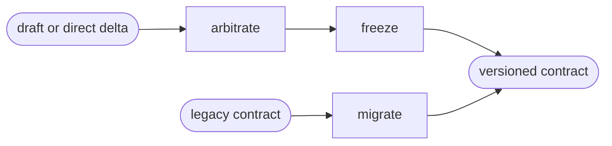

# Adjust

Read only the next action in the selected path.

| Action | Does |
| --- | --- |
| arbitrate | resolve conflicts in a draft or scoped delta |
| freeze | write or update the versioned contract |
| migrate | migrate a legacy contract without changing its verdict |

## Routing

- "arbitrate and freeze this draft or delta" → `arbitrate`
- "migrate this legacy design contract" → `migrate`

## Transversal rules

- Resolve the plugin root using [host-portability.md](../../references/host-portability.md) before loading bundled tools or references.
- Accept a draft, an existing frozen contract plus a scoped delta, or a legacy contract; no prior capability is mandatory.
- On a direct delta, preserve every untouched token and component and arbitrate only the supplied change.
- Never install gates or render components.
- Never freeze a contract with a measurable reference whose fidelity gate is incomplete: `oracle.json § pages` must pass `config-gen.py --check` and resolve every mockup target.
- Keep the five contract artifacts and `release.json` backward compatible with contract 2.x.
