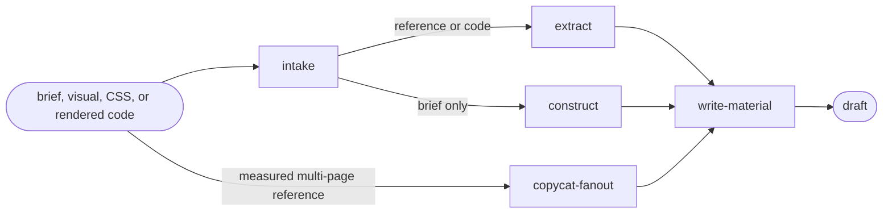

# Define

Read only the next action in the selected path.

| Action | Does |
| --- | --- |
| intake | classify the supplied source |
| extract | extract design evidence from a reference or rendered code |
| construct | construct design material from a written brief |
| write-material | write mutable tokens and a draft charter |
| copycat-fanout | reconcile a measured multi-page reference |

## Routing

- "create or extract design material from this source" → `intake`
- "write this already prepared mutable token set" → `write-material`
- "reconcile this measured multi-page reference" → `copycat-fanout`

## Transversal rules

- Resolve the plugin root and subagent behavior using [host-portability.md](../../references/host-portability.md).
- Stop after producing mutable material; never freeze a contract, install gates, or render components.
- Treat existing rendered code as extraction evidence, not as a reason to run a complete lifecycle.
- Write no contract root or generated adapter from this capability.
- Present the palette, typography, and icon set before expanding the complete token set, then continue unless the user objects.
