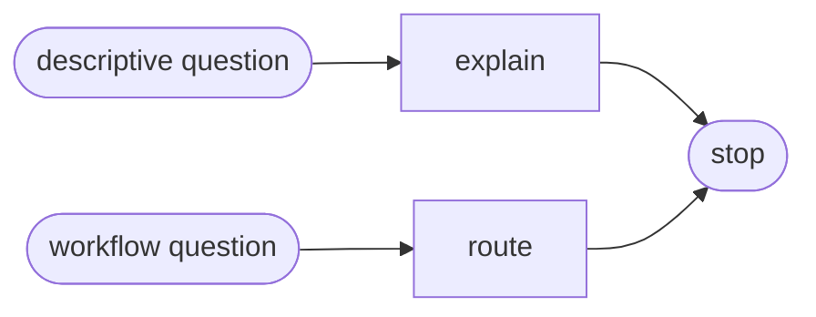

# Detail

Read only the next action selected by the user's question.

| Action | Does |
| --- | --- |
| explain | explain one capability or the complete map |
| route | route an explicit workflow request from observed project state |

## Routing

- "explain the design plugin or one capability" → `explain`
- "which complete workflow should I run" → `route`

## Transversal rules

- Resolve the plugin root using [host-portability.md](../../references/host-portability.md) before loading bundled tools or references.
- Stay read-only and never invoke the capabilities being described.
- A precise production, critique, freeze, audit, or rendering request belongs directly to that capability; do not intercept it here.
- Emit the full five-capability recipe only when the user explicitly asks for a complete design-system lifecycle.
- Keep `wireframes` and `harness` outside that lifecycle. Name the optional `wireframes → review → harness` prerequisite only when an interface still needs exploration.
- Read [funnel-map.md](references/funnel-map.md) for capability boundaries and [workflow-classes.md](references/workflow-classes.md) for complete lifecycle routes.
