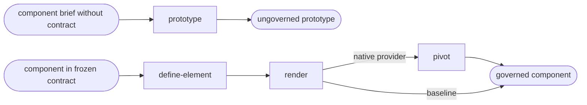

# Diffuse

Read only the next action in the selected path.

| Action | Does |
| --- | --- |
| prototype | create a scoped ungoverned prototype |
| define-element | define a neutral component from the contract |
| render | render and verify the governed component |
| pivot | route a native rendering to an installed language provider |

## Routing

- "prototype this component without a contract" → `prototype`
- "define this governed component from the contract" → `define-element`
- "render this governed component" → `render`
- "render this component through the native language provider" → `pivot`

## Transversal rules

- Resolve the plugin root using [host-portability.md](../../references/host-portability.md) before loading bundled tools or references.
- A local component request does not trigger contract creation or the complete lifecycle.
- Without `release.json`, run `prototype` and label every output as ungoverned; never claim conformity, maturity, or a green gate.
- With a frozen contract, reject stale generated artifacts and require the blocking gates to pass before delivery.
- A baseline HTML and CSS output is a preview until promoted into the target application's language.
