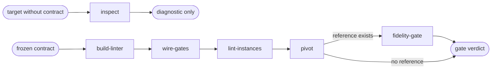

# Enforce

Read only the next action in the selected path.

| Action | Does |
| --- | --- |
| inspect | inspect a target without claiming conformity |
| build-linter | install the portable contract-derived linter |
| wire-gates | wire contract checks into selected lifecycle points |
| lint-instances | check and reconcile existing instances |
| pivot | route native enforcement to an installed language provider |
| fidelity-gate | measure rendered fidelity against a reference |

## Routing

- "audit this design target without a contract" → `inspect`
- "install the contract-derived linter" → `build-linter`
- "wire the design gates" → `wire-gates`
- "lint or reconcile these instances" → `lint-instances`
- "create native enforcement for this language" → `pivot`
- "measure fidelity against this reference" → `fidelity-gate`

## Transversal rules

- Resolve the plugin root and persistent host surface using [host-portability.md](../../references/host-portability.md).
- A request to audit one page, component, or codebase without a contract runs `inspect` alone.
- `inspect` is read-only and may report risks and missing evidence; it never emits green, maturity, or conformity.
- Contract enforcement requires `release.json`; do not silently create or infer a contract.
- Classify evidence using [control-priorities.md](../../references/control-priorities.md): P0 and P1 block, while P2 only warns.
- Preserve public exit codes 0 clean, 1 blocking violation, 2 invalid invocation or contract, 3 legacy contract, and 4 maturity below threshold.
