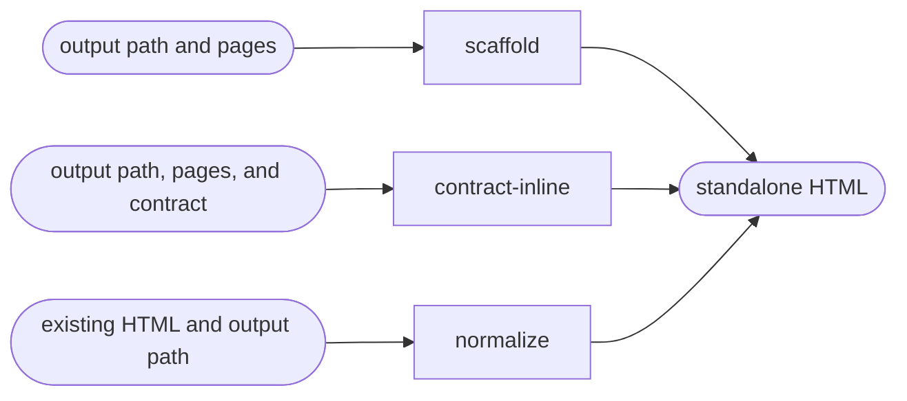

# Harness

Select from the requested input and intent, then read only that action file.

| Action | Does |
| --- | --- |
| scaffold | generate a standalone measurable mockup |
| contract-inline | generate a mockup with the frozen token stylesheet |
| normalize | rebuild existing HTML inside the canonical harness shell |

## Routing

- "generate a standalone measurable mockup" → `scaffold`
- "generate a measurable mockup with this frozen contract" → `contract-inline`
- "analyze, repair, or import this existing HTML as a harness" → `normalize`

## Transversal rules

- Resolve the plugin root using [host-portability.md](../../references/host-portability.md) before invoking the generator or runtime checker.
- Stay outside the design-system lifecycle and change no contract artifact.
- Require an explicit output path and validate page keys before writing.
- When page sources, routes, or contract themes are known, preserve them in `--pages-json` so the generated LLM framing remains grounded and applies the right theme at runtime.
- Preserve the public exit space 0 success, 2 invalid input, and 3 legacy contract.
- Read [harness-contract.md](../../references/harness-contract.md) for the generated runtime interface and safety constraints.
- Normalization reports format conformance, runtime validity, migration completeness, and visual delta independently. Route visual contract conformity to `design:enforce` only after those normalization outcomes are explicit.
