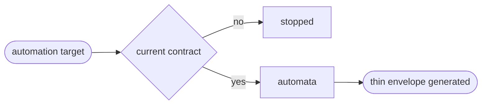

# Deploy

## Actions

Run the flow above. Read only the next action file.

| Action | Does |
| --- | --- |
| automata | generate a thin envelope for one named automata target |

## Transversal rules

- Read [host portability](../../references/host-portability.md), [the common contract](../../references/cd-contract.md), and [the project schema](../../references/cd-project-contract.schema.json) before acting.
- Require a current contract from the root application or static owner before any automation write.
- Own repository envelopes only and never own provider configuration or redetect the deployment procedure.
- Never create another environment, collect secret values, contact production during configuration, mask a failure, or invent an unsupported provider.
- Require an exact target id when a contract declares several targets. Read only that target's phase, mode, provider, invocation, lifecycle guard, lock, secrets, proof and recovery.
- Keep unsupported status isolated to the selected target. Never aggregate paths, data, media or credentials across targets, and refuse every target-to-target flow.
