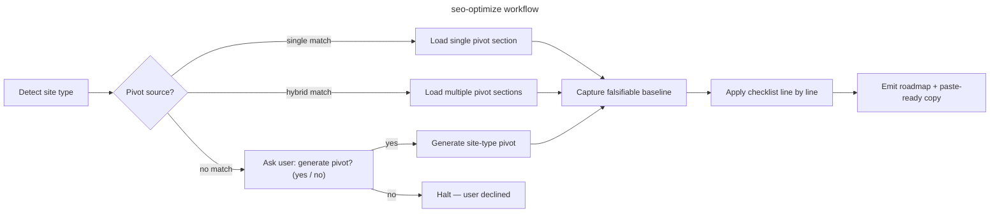

# seo-optimize

## Goal

Run a structured SEO/GEO audit on a website, picking the right checklist for the detected site type, grounding every finding in an authoritative source (Google Search Central / Schema.org / GBP guidelines — never SEO folklore), and emit an actionable roadmap plus ready-to-paste copy.

## Rules

- Detect the site type BEFORE picking a checklist — never assume `local-business`
- **After detecting the site type, load matching pivots** from `references/seo-geo-pivots.md` (or a future `sc-seo-*` plugin pivot at `.claude/rules/07-quality/seo-pivots-<sitetype>.md` if installed — it takes precedence). Load matching section(s) as the primary source for §1–§11. For hybrid sites (e.g. `local-business` + `blog`), concatenate sections
- Capture a **falsifiable baseline** (GSC positions/impressions, GBP completeness score, AI citation grid, schema validity) BEFORE recommending changes — without baseline, ranking claims are unfalsifiable
- Recommend changes only after reading at least these 3 real artifacts: (a) the rendered `<head>` of the hot route (or the framework head config — `useHead`/`useSeoMeta`, `next/head`/`generateMetadata`, static `<head>`), (b) `robots.txt` + `sitemap.xml`, (c) one hot landing page's body content. Generic SEO advice without this evidence is rejected
- **Ground every finding** in an authoritative source via `references/serp-signals.md` — distinguish confirmed ranking factors from correlation/folklore before recommending a fix
- One row per checklist item, with `🟢 / 🟡 / 🔴 / N/A` + `file:line` / GSC value / GBP field reference when actionable
- **Primary deterministic signal** (title present + length, meta present + length, schema valid per Rich Results Test, canonical present, `alt` coverage %, NAP consistency, GBP completeness) is load-bearing for success. GSC position / AI citation rank is a **secondary noisy signal** — report it but never anchor success solely on it
- Ranking/citation variance dominates any single fix: read GSC positions over **≥7 days** and re-test the AI citation grid **≥2×** before attributing a change. A single-day position or one ChatGPT query is unfalsifiable
- **Content truthfulness**: the site's own figures (prices, distances, capacities, opening hours) are the source of truth. NEVER invent or embroider numbers in generated copy — if a figure is unknown, emit a `[placeholder]` and flag it for the user
- **Encoding guard**: when generating copy destined for a database, respect the target storage encoding — if the store is not UTF-8 (e.g. LATIN9), sanitize typographic characters (em-dash `—`, ellipsis `…`, smart quotes) to ASCII before delivering paste-ready copy
- Output goes to `aidd_docs/tasks/audits/<yyyy_mm_dd>_seo-<sitetype>-<scope-slug>.md`. If `aidd_docs/` does not exist, fallback to `docs/seo-audits/<yyyy_mm_dd>_seo-<sitetype>-<scope-slug>.md` (create dir if needed). Same-day rerun on the same scope → suffix `-v2`, `-v3` (no overwrite)
- The DEC step (recording a non-obvious trade-off) is **conditional**: only if `aidd_docs/internal/decisions/` exists; otherwise inline the rationale in the audit report itself

## Scope boundaries

`seo-optimize` couvre la découvrabilité (organique + génératif) : indexabilité, on-page, données structurées, extractabilité IA, local SEO/GBP, E-E-A-T, et la lecture du CWV **comme signal de ranking**. Il ne mesure pas la performance technique — il la consomme.

| Dans le périmètre | Hors périmètre — outil dédié |
|---|---|
| §1–§7, §9–§10 : indexabilité, on-page, schema, GEO/IA, GBP, E-E-A-T, tracking | `web-optimize` : LCP / CLS / INP / bundle / render-blocking |
| §8 : CWV comme **signal de ranking** (lit le rapport perf existant) | `web-optimize` : **production** de la métrique CWV |
| Copy on-page / méta / GBP prêt à coller | `writing` plugin : rédaction long-format éditoriale |
| §9 backlinks / citations (constat via Ahrefs) | netlinking outreach actif (hors outil) |

Quand §8 a besoin de données CWV et qu'aucun audit `web-optimize` récent n'existe → lancer `web-optimize` d'abord (ou le recommander), puis consommer sa sortie déterministe.

## Pre-implementation quick check

Before shipping a page, meta block, or JSON-LD that targets a ranking signal, load `references/serp-signals.md` and verify the targeted lever is **confirmed** (Google Search Central / Schema.org / GBP), not folklore (§2 meta keywords / keyword density, §4 "schema improves rank", §8 "Lighthouse score = rank"). This prevents shipping effort against non-signals before it reaches the audit. When generating copy, also pre-clear the **truthfulness** (no invented figures) and **encoding** (ASCII if non-UTF-8 store) guards from the Rules.

## Quick Start

```bash
# 1. Detect head-rendering layer + existing SEO surface
grep -rl "useHead\|useSeoMeta" --include="*.vue" --include="*.ts" 2>/dev/null | head   # Nuxt / Vue
grep -rl "next/head\|generateMetadata" --include="*.tsx" --include="*.ts" 2>/dev/null | head  # Next
grep -rl "application/ld+json" --include="*.vue" --include="*.html" --include="*.tsx" 2>/dev/null | head  # existing JSON-LD
ls public/robots.txt public/sitemap.xml static/robots.txt 2>/dev/null   # static SEO files
ls public/llm.txt public/llms.txt 2>/dev/null                          # GEO / AI-crawler file

# 2. Signal the site type (drives the pivot section to load)
#   local-business : NAP (adresse / téléphone), GBP, horaires, map embed
#   saas           : pricing page, signup, feature pages
#   blog/content   : posts/, articles, RSS, author pages
#   e-commerce     : products, cart, Product/Offer schema
#   docs/portfolio : guides, API ref, project pages

# 3. Check baseline tooling availability (GEO-complete path)
#   Ahrefs MCP  : gsc-keywords, gsc-pages, brand-radar-*, rank-tracker, serp-overview, site-audit-issues
#   If absent   : fall back to manual GSC export + manual AI citation grid (references/geo-extractability.md)
```

> **Cross-project use:** this skill lives in the `overcode` plugin. Install the plugin to use it across projects. For the GEO-complete path, connect the Ahrefs MCP (GSC + Brand Radar) so the baseline is data-driven, not manual.

## Workflow



### Step 1: Detect site type

**Do:**

1. Read the rendering layer and SEO surface (a site can mix types):
   - head config: `useHead` / `useSeoMeta` (Nuxt/Vue), `generateMetadata` / `next/head` (Next), static `<head>`
   - `robots.txt`, `sitemap.xml`, `llm.txt` presence
   - existing `application/ld+json` blocks
2. Map to one (or more) of:
   `local-business`, `saas`, `blog`, `e-commerce`, `docs`, `portfolio`, `other`
3. Tell-tale signals:
   - `local-business`: NAP, GBP listing(s), opening hours, map embed, geo-named pages
   - `saas`: pricing, signup/login, feature/solution pages
   - `blog`/`content`: posts, author pages, RSS, tags
   - `e-commerce`: products, cart, `Product`/`Offer` schema
4. **Hybrid site:** if a marketing site carries both a local presence AND a blog (very common), audit BOTH — load every matching pivot section. Do NOT invent a combined type.

**Success criteria:** Site type(s) + GSC property + GBP listing count reported back to user.

### Step 2: Pick or propose pivot

**Do:**

1. **Check installed plugin pivots first** — scan `.claude/rules/07-quality/seo-pivots-*.md` for a file matching the detected type. If found → primary source, proceed to Step 3.
2. **If no plugin pivot**, load the matching section(s) of `references/seo-geo-pivots.md`. For hybrid sites, concatenate.
3. **If no section matches the type:** halt and ask the user:

   > "No SEO/GEO pivot exists for `<sitetype>`. Should I generate one from the fallback procedure in `references/seo-geo-pivots.md`, adapted to this project? (yes / no)"

4. **If user accepts generation:**
   - Follow the fallback procedure in `references/seo-geo-pivots.md`
   - Use the 12 numbered sections (§0 Pre-flight → §11 Verification) **plus** a `## Common anti-patterns (rejected)` table **plus** a `## Quick verification commands` block
   - **If `aidd_docs/internal/decisions/` exists:** create a DEC documenting the convention choices. **Otherwise:** inline the conventions in the pivot header
   - Continue to Step 3

**Success criteria:** A pivot source is loaded into context, site-type-appropriate.

### Step 3: Capture baseline

**Do:**

1. **Organic baseline (GSC)** — pull positions + impressions + clicks for the target queries over **≥7 days** (28 preferred). Use Ahrefs MCP `gsc-keywords` / `gsc-pages`, or a manual GSC export. Record min/median/max position per query (SERP volatility = the noise floor).
2. **AI/GEO baseline** — run the citation grid (`references/geo-extractability.md`): the target queries × engines (ChatGPT, Perplexity, Google AI Overviews), recording whether the brand is cited and at what rank. Use Ahrefs Brand Radar (`brand-radar-*`) if connected, else manual testing. Re-test ≥2× to characterize variance.
3. **GBP baseline** (local-business) — score each listing against §6 fields (category, description, services, Q&A, photos, posts, NAP). Note the completeness score per listing.
4. **Deterministic on-page baseline** — count: pages with title/meta present + within length, valid schema blocks (Rich Results Test), canonical present, `alt` coverage %, noindex on technical pages, sitemap entries. **This is the load-bearing signal.**
5. Save baseline as a code block in the audit report header — **characterize ranking variance explicitly** (e.g. "position 4–9 across 28 days, query X").

**Success criteria:** GSC positions quoted with date range AND AI citation grid filled AND GBP score recorded AND deterministic on-page baseline (counts) recorded.

### Step 4: Apply checklist

**Do:**

1. For each section §0–§11, run the verification commands at the bottom of the loaded pivot
2. Mark items with status emoji + actionable note (`file:line`, GSC value, GBP field, or fix recipe)
3. Quick verification reflexes:

   ```bash
   # On-page surface
   grep -rn "useSeoMeta\|useHead" --include="*.vue" --include="*.ts"      # title/meta declared?
   grep -rn "application/ld+json" --include="*.vue" --include="*.html"     # JSON-LD present?
   grep -rn "rel=.canonical" --include="*.vue" --include="*.html"         # canonical?
   grep -rn "noindex" --include="*.vue" --include="*.ts"                  # technical pages excluded?
   grep -rn "/dev/null
   cat public/llm.txt public/llms.txt 2>/dev/null                          # GEO file present?
   ```

4. For each finding, cross-check against `references/serp-signals.md` — confirm the fix targets a **confirmed signal**, not folklore (keyword density, meta keywords tag, exact-match domains, etc. are rejected)
5. **§8 CWV** — do NOT recompute; read the latest `web-optimize` audit report and cite its deterministic CWV deltas as the ranking-signal status. If none exists, mark §8 `🟡 — run web-optimize first`
6. Group fixes by ROI (quick wins / structural / monitoring)
7. **Null result handling**: record zero-finding steps explicitly ("§4 schema: FAQPage already valid on all 5 location pages — gisement exhausted") so the next iteration doesn't redo the audit

**Success criteria:** Every checklist line has a status; no `[ ]` left unchecked. Null results documented.

### Step 5: Emit roadmap + copy

**Do:**

1. **Intermediate review gate**: if the audit surfaces > 30 🔴+🟡 items, present a synthesis (top 10 by ROI) and ask for prioritization confirmation BEFORE writing the final report
2. Output to `aidd_docs/tasks/audits/<yyyy_mm_dd>_seo-<sitetype>-<scope-slug>.md` (fallback `docs/seo-audits/...`)
   - **If `<scope>` not provided:** default to `full-site`
   - **Same-day rerun:** suffix `-v2`, `-v3`
3. Phases ordered by ROI (F0 indexability/blockers → F1 on-page quick wins → F2 structural content/schema → F3 GBP/off-page/monitoring)
4. **Ready-to-paste copy** (titles, metas, H1, FAQ, GBP fields) under each relevant item — apply the **truthfulness guard** (no invented figures, `[placeholder]` for unknowns) AND the **encoding guard** (ASCII if non-UTF-8 store)
5. End with a **KPI tracking table** J0 → J+30 → J+60 → J+90 (GSC position/impressions per query, GBP score, AI citation grid) so gains are measurable
6. **Per-fix success criterion**: define primary (deterministic delta — schema valid, meta present, NAP consistent) + secondary (GSC median position). Declare "real gain" only if GSC **median position post-fix beats the baseline range**, else: "fix shipped, ranking variance dominates, deterministic delta is the trustable signal"
7. **Bugs found during audit → issue, not normative patch**: a single broken canonical or a stray noindex belongs in the roadmap (file:line + fix) + a tracker issue — never in the pivots or `.claude/rules/`. Threshold for normative elevation: ≥ 2 distinct occurrences OR a known generic class

**Success criteria:** User can execute Phase F0 from the report alone. Each fix has a deterministic primary criterion. Generated copy is truthful and encoding-safe.

### Step 6: Self-audit & skill feedback

**Do:**

1. After the report is written, walk §12 of the pivot (self-audit) — mandatory
2. Append a `## Checklist learnings` section at the top of the audit report:
   - Gaps — `[gap] §N: <missing bullet>`
   - False positives — `[fp] §N: <bullet> — reason`
   - Reworded items — `[reword] §N: <before> → <after>`
   - Anti-patterns surfaced ≥ 2× — `[antipattern] <pattern> | <why rejected>`
   - Useful ad-hoc commands — `[grep] <command> — <what it surfaces>`
   - Missing pivots — `[pivot] <sitetype>: <missing pivot>`
3. **Trigger threshold**: ≥ 3 gaps OR ≥ 1 anti-pattern OR ≥ 1 missing pivot → propose patches explicitly (do NOT silently edit):
   - Diff for `references/seo-geo-pivots.md`
   - Diff for `references/geo-extractability.md` or `references/serp-signals.md`
   - Diff for `tests.md` if a new detection case emerged
4. On accept → apply; on reject → archive learnings in the report only
5. Below threshold → keep `## Checklist learnings` in the report; future audits aggregate

**Success criteria:** Every audit ends with a `## Checklist learnings` section, even if empty (`[none]`). The skill gets monotonically better project-by-project.

## Resources

| Type      | Path                                            | Description                                                                                  |
| --------- | ----------------------------------------------- | -------------------------------------------------------------------------------------------- |
| Reference | `references/seo-geo-pivots.md`                  | Pivots per site type (local-business, SaaS, blog, e-commerce, docs) — the 12-section model  |
| Reference | `references/geo-extractability.md`              | AI citability: direct-answer blocks, FAQPage schema, llm.txt, entity consistency, test grid |
| Reference | `references/serp-signals.md`                    | Authoritative grounding (Google Search Central / Schema.org / GBP) — confirmed vs folklore  |
| Output    | `aidd_docs/tasks/audits/<yyyy_mm_dd>_seo-<sitetype>-<scope-slug>.md` | Audit report destination (fallback `docs/seo-audits/...`)              |
| Tests     | `tests.md`                                      | Smoke test cases for site-type detection — run before trusting the skill on a new site type |
| Sibling   | `../web-optimize/SKILL.md`                       | Produces the CWV metric consumed by §8 (ranking signal). Run it first if §8 has no data     |
