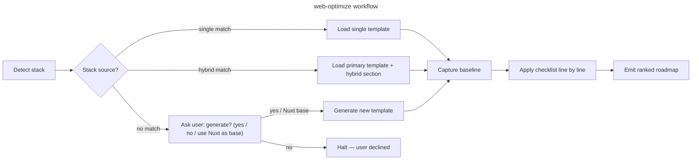

Read [host portability](../../references/host-portability.md) before resolving plugin files, invoking sibling skills, or persisting project guidance.

# web-optimize

## Goal

Run a structured performance audit on a web project, picking the right checklist for the detected stack, and emit an actionable roadmap.

## Rules

- Detect the stack BEFORE picking a checklist — never assume any specific framework
- **After detecting the stack, look for installed pivot rules** at `${PROJECT_RULES_ROOT}/07-quality/perf-pivots-<stack>.md` (provided by `sc-*` plugins — which plugin covers which stack is in `${OVERCODE_PLUGIN_ROOT}/references/pivot-providers.md`, never guessed). If found → load as the primary source for §1–§11. If not found → fall back to `references/framework-mapping.md` + its fallback procedure, **and say so in the output** — falling back is allowed, falling back silently is not. For hybrid stacks, load every matching `perf-pivots-*.md` and concatenate
- Capture a baseline (PSI / Lighthouse / build output / DB query count) BEFORE recommending changes — without baseline, gains are unfalsifiable
- If no pivot covers the detected stack, name the cause before proposing anything: **no plugin provides one** (the stack has no line in `${OVERCODE_PLUGIN_ROOT}/references/pivot-providers.md`) → propose generating a checklist; **a plugin provides one and nothing is installed here** → recommend that plugin and its install command, read from that table. Never silently fall back to a stack-mismatched checklist, and never run the installer yourself — this skill reports and recommends, it does not install (DEC-007 §2)
- **Every report states the provenance of its checklist** — two fields, `source` and `pivot`, one pair per applicable stack. See Step 5 for the exact form
- Recommend changes only after reading at least these 3 files of the actual codebase: (a) the framework config (`nuxt.config.ts` / `vite.config.ts` / `settings.py` / `routes/web.php` / equivalent), (b) the entry point (`app.vue` / `urls.py` / `bootstrap/app.php` / equivalent), (c) one hot route — typically the LCP target. Generic advice without this evidence is rejected
- One row per checklist item, with `🟢 / 🟡 / 🔴 / N/A` + `file:line` references when actionable
- Output goes to `aidd_docs/tasks/audits/<yyyy_mm_dd>_perf-<framework>-<scope-slug>.md`. If `aidd_docs/` does not exist, fallback to `docs/perf-audits/<yyyy_mm_dd>_perf-<framework>-<scope-slug>.md` (create dir if needed). Day-level granularity prevents collision when multiple audits target the same scope in one month
- If a same-day rerun produces a new file for the same scope, append `-v2`, `-v3` to the slug rather than overwriting the previous report
- The DEC step (recording a non-obvious trade-off) is **conditional**: only if `aidd_docs/internal/decisions/` exists; otherwise inline the rationale in the audit report itself
- **Primary deterministic metric** (bytes saved, chunks blocked, SQL queries removed, requests removed) is load-bearing for success. PSI score is a secondary noisy signal — report it but never anchor success solely on it
- PSI variance can dominate any single fix: capture **3-5 baseline runs** before attributing changes (single-run baseline is unfalsifiable). Anonymous Google PSI API rate-limits at ~25/day → for 5+ programmatic runs use https://pagespeed.web.dev/ web UI manually OR a Google API key

## Scope boundaries

`web-optimize` couvre les métriques web (render-blocking, LCP, CLS, INP/TBT, bundle, CSS, caching, SSR/hydration, TTFB latence). Les pivots installés par les plugins `sc-*` — quelle stack, quel plugin : `${OVERCODE_PLUGIN_ROOT}/references/pivot-providers.md` — précisent la mise en œuvre concrète par stack.

| Dans le périmètre | Hors périmètre — outil dédié |
|---|---|
| §0–§8 : render, images, bundle, CSS, cache, SSR | `data-optimize` : N+1 queries, quota, payload bytes, index DB |
| §9 TTFB latence serveur (symptôme) | `data-optimize` : causes DB/API du TTFB |
| Scripts tiers chargement lazy | `overcode:service verify` : compliance consent GTM/Clarity/Klaviyo |
| CWV **mesuré** (LCP/CLS/INP déterministe) | `seo-optimize` §8 : CWV **comme signal de ranking** + on-page, schema, GEO/IA, GBP |

Quand §9 dépasse 200ms sans cause render-blocking évidente → recommander `data-optimize` sur la route hot path.

**Handoff SEO/GEO** — surface SEO technique croisée (title/meta, `alt`, JSON-LD, canonical, noindex, hreflang) : si l'audit révèle des lacunes hors périmètre perf, **ne pas les traiter ici** → recommander `seo-optimize` (il consomme la sortie CWV de cet audit comme signal de ranking dans son §8). Frontière : `web-optimize` produit la métrique CWV, `seo-optimize` l'interprète pour le ranking.

## Pre-implementation quick check

Before shipping a component that touches DOM rendering, network requests, or JS execution, load `references/w3c-perf-specs.md` and verify the relevant spec entries (§1 LCP if adding hero image, §2 CLS if adding media, §3 INP if adding event handlers, etc.). This prevents regressions before they appear in PSI.

## Quick Start

```bash
# 1. Detect the stack — read every relevant manifest
cat package.json 2>/dev/null | grep -E '"(nuxt|vite|vue|astro|svelte|alpinejs)"'
cat composer.json 2>/dev/null | grep -E '"(laravel|symfony|wordpress)/'
ls manage.py 2>/dev/null && echo "Django (settings.py is typically in a subfolder, e.g. <project>/settings.py)"
grep -r "alpinejs" --include="*.html" --include="*.blade.php" --include="*.twig" -l 2>/dev/null | head -5
test -f wp-config.php && echo "WordPress detected"
# Rust — the manifest is almost never at the root: search down, skip build output
find . -maxdepth 3 -name Cargo.toml -not -path '*/target/*' 2>/dev/null \
  | xargs grep -l -E '^(axum|actix-web|rocket) *=|^(axum|actix-web|rocket) *\.' 2>/dev/null

# 1bis. Detect package manager from lockfile (drives all build commands below)
PM=${PM:-pnpm}
[ -f pnpm-lock.yaml ]    && PM=pnpm
[ -f yarn.lock ]         && PM=yarn
[ -f package-lock.json ] && PM=npm
[ -f bun.lockb ]         && PM=bun
echo "Using package manager: $PM"

# 1ter. Detect monorepo — if any workspace marker is found, STOP and ask user which package to audit
# JS/TS: pnpm-workspace.yaml, turbo.json, nx.json, lerna.json
# Rust: a Cargo.toml carrying [workspace] — it is often NOT at the root (e.g. engine/Cargo.toml)
ls pnpm-workspace.yaml turbo.json nx.json lerna.json 2>/dev/null
find . -maxdepth 3 -name Cargo.toml -not -path '*/target/*' 2>/dev/null \
  | xargs grep -l '^\[workspace\]' 2>/dev/null
echo "⚠️  Any output above = monorepo — STOP and ask the user which package/workspace to audit before continuing"
# When you ask, list every candidate you found — the Rust workspace members are candidates too,
# not noise to drop because a JS marker also matched.

# 2. Capture baseline (uses $PM detected above)
$PM nuxt build 2>&1 | tee build.log                 # Nuxt — log written to CWD (cross-platform)
$PM vite build --mode production 2>&1 | tee build.log  # Vue SPA
# Django smoke — Bash/WSL syntax shown; on PowerShell: Start-Job { python manage.py runserver }; wrk ...
# wrk install: brew install wrk / apt install wrk / WSL ; fallback: ab -n 100 -c 10 ...
python manage.py runserver & wrk -d 30s http://localhost:8000/
# Then: open https://pagespeed.web.dev/ on the deployed routes

# 3. Apply checklist (see Workflow)
```

> **Cross-project use:** install the `overcode` plugin through the active host's marketplace. Do not copy a bundled skill into a host-specific skills directory.

## Workflow



### Step 1: Detect stack

**Do:**

1. Read all relevant manifests (a project can mix backend + frontend layer):
   - `package.json` → JS/TS frameworks
   - `composer.json` → PHP (Laravel, Symfony, vanilla)
   - `requirements.txt` / `pyproject.toml` / `manage.py` → Django / Flask / FastAPI. Read the same manifest for the **layers** that ride on top of the framework and carry their own perf checklist: `djangorestframework` (API layer over Django), `celery` (task worker), `httpx` (outbound HTTP client)
   - `Cargo.toml` → Rust web crates. **Search down, not at the root only** — in practice the manifest sits one to three levels in (`app/`, `engine/core/`, `app/rust-backend/`). Bound: `-maxdepth 3 -not -path '*/target/*'`; `target/` holds vendored manifests of every transitive dependency and would flood the match.
2. Map to one (or more) of:
   `nuxt`, `vue-spa`, `astro`, `svelte-kit`, `static-html`,
   `django`, `django+alpine`, `django+htmx`, `drf`, `fastapi`,
   `php-laravel`, `php-symfony`, `php-vanilla`, `wordpress`, `php+alpine`,
   `alpine-spa`, `rust-axum`, `rust-vanilla`, `other`
   *(Next.js, Remix, SolidStart, Qwik, Vue 2 / Nuxt 2 fall under `other` until pivots are added to `references/framework-mapping.md`.)*
   **`drf` concatenates with `django`, it does not replace it.** A Django REST Framework project is a Django project with an API layer: it maps to both, and loads both pivots — which is what `perf-pivots-drf.md` says of itself.
   **Rust without a web framework is `rust-vanilla`, not `other`.** A crate holding no `axum` / `actix-web` / `rocket` dependency is still a recognised stack: it emits a pair whose `pivot` axis reads `no provider` — `rust-vanilla` has no line in `pivot-providers.md`. It does **not** open a "this family does not apply" halt, and it must never be folded into `other`: `other` reaches the same `no provider` by a route that stops being right the day `sc-rust` ships a second `perf` pivot.

   **Additive layers — they add to a stack, they never are one.** These slugs coexist with any backend and are never the only value a project maps to:
   `celery`, `httpx`, `vite`
   A Django + Celery + httpx project maps to **three** slugs and emits **three** provenance pairs. A project that mapped to `celery` alone would be mis-detected: a task worker is not a web stack, and `perf-pivots-vite.md` says of itself that it is a build tool hybrid with any backend. This is not the hybrid case of 4 below — that one pairs a backend with a frontend, both of which are stacks.
   ⚠ **A stack slug is not a pivot filename.** Every slug above resolves to `perf-pivots-<slug>.md` **except** those declared here, one line each. A divergence left unwritten makes its pivot unreachable, and `tools/eval/pivot-map.mjs` fails the build on it — so the absence of a line is a statement, not an oversight. Resolve the pivot through `${OVERCODE_PLUGIN_ROOT}/references/pivot-providers.md`, never by pasting the slug into the filename — a slug that matches no line there is `no provider`, and a slug that matches a differently-named pivot is **not**.
   - `svelte-kit` → `perf-pivots-sveltekit.md`
   - `static-html`, `astro` → `perf-pivots-static.md`
   - `php-laravel` → `perf-pivots-laravel.md`
   - `php-symfony` → `perf-pivots-symfony.md`
   - `php-vanilla` → `perf-pivots-vanilla.md`
   - `alpine-spa` → `perf-pivots-alpine.md`
   - `rust-axum` → `perf-pivots-axum.md`
   - `django+alpine` → `perf-pivots-django.md` + `perf-pivots-alpine.md`
   - `django+htmx` → `perf-pivots-django.md` + `perf-pivots-htmx.md`
   - `php+alpine` → `perf-pivots-alpine.md`
   - `drf` → `perf-pivots-django.md` + `perf-pivots-drf.md`
   `rust-vanilla` is absent from this list on purpose: it resolves by identity to a `perf-pivots-rust-vanilla.md` that no plugin ships, hence `no provider`. Reading it as `perf-pivots-vanilla.md` — the JS one — because the slug ends in `vanilla` is exactly the guess this note forbids.
3. Tell-tale config files:
   - `nuxt.config.ts`, `vite.config.ts`, `astro.config.mjs` — a `vite.config.*` outside a Nuxt/Astro project is the `vite` layer itself, not just a build artefact of another slug
   - `manage.py`, `settings.py` (Django) ; `rest_framework` in `INSTALLED_APPS` (DRF)
   - `main.py` / `app.py` holding `FastAPI()` (FastAPI) — the constructor, not the dependency alone
   - `celery.py` / `tasks.py` + a `CELERY_BROKER_URL` setting (Celery) ; `httpx` in the dependency manifest (outbound HTTP layer)
   - `artisan`, `routes/web.php` (Laravel) ; `bin/console` (Symfony)
   - `Cargo.toml`, `Cargo.lock`, `src/main.rs` (Rust) — `main.rs` separates a binary that serves from a library crate that does not
   - `<script src=".../alpinejs">` or `import 'alpinejs'`
4. **Hybrid stack:** if backend (Django/PHP) + frontend layer (Alpine/Vue) coexist, audit BOTH layers — load relevant sections from both `references/framework-mapping.md` entries (do NOT generate a new combined template).

**Success criteria:** Stack(s) + version + role (backend/frontend/full-stack) reported back to user.

### Step 2: Pick or propose checklist

**Do:**

1. **Check installed plugin pivots first** — scan `${PROJECT_RULES_ROOT}/07-quality/perf-pivots-*.md` for files matching the detected stack(s). They are installed by `sc-*` plugins, each with its own install command — the mapping `<stack> → <plugin>, <command>` is in `${OVERCODE_PLUGIN_ROOT}/references/pivot-providers.md`. They are the authoritative source when present.
2. **If matching pivot(s) found**: load them as the primary checklist source and proceed to Step 3. For hybrid stacks (e.g. `django+alpine`, `firebase+prisma`), load every matching `perf-pivots-*.md` and concatenate items.
3. **If no pivot rule found**, read the state right here and emit the recommendation now — do not wait for the terminal guard below, which is only reached when no template matches either:
   - the stack **has a line** in `pivot-providers.md` → recommend running that plugin's install command **in this project** (quote plugin + command verbatim from the table), then continue down the ladder
   - the stack **has no line** → `no provider`; nothing to recommend, generation is the only remedy

   Then look for a matching template under `aidd_docs/templates/dev/perf_checklist_*.md` (or `docs/perf-templates/` if no `aidd_docs/`).
4. **If neither pivot nor template matches the stack:** halt the workflow and ask the user before proceeding:

   > "No perf pivot or checklist exists for `<stack>`. Options: (a) if `pivot-providers.md` lists a plugin for this stack, run its install command in this project — it is quoted in the recommendation above, (b) generate `perf_checklist_<stack>.md` from `references/framework-mapping.md` fallback procedure for one-off use, or (c) abort."

   Option (a) is about **installing the rules here**, not about installing the plugin: the plugin is usually already present, and re-installing it is not the remedy. Adding a missing plugin only comes after, and only if the table names one this project does not have.

5. **If user accepts generation:**
   - Follow the fallback procedure in `references/framework-mapping.md`
   - Use the 12 numbered sections (§0 Pre-flight, §1 Critical path, §2 LCP, §3 CLS, §4 JS bundle, §5 CSS, §6 Caching, §7 SSR, §8 INP/TBT, §9 TTFB, §10 Client storage, §11 Verification) **plus** a `## Common anti-patterns (rejected)` table **plus** a `## Quick verification commands` block
   - Write to `aidd_docs/templates/dev/perf_checklist_<stack>.md` (or `docs/perf-templates/<stack>.md`)
   - **If `aidd_docs/internal/decisions/` exists:** create a DEC documenting the convention choices
   - **Otherwise:** inline the chosen conventions in the new template's header
   - Suggest packaging the produced template as a `sc-<stack>` plugin if reuse is likely
   - Continue to Step 3

**Success criteria:** A checklist source is loaded into context, stack-appropriate, **and the pair `source` / `pivot` is determined for every applicable stack** — loading without reporting is the defect this step must not produce.

### Step 3: Capture baseline

**Do:**

1. Run framework build, capture warnings (Vite "dynamic import will not move", chunk sizes, errors); for Django/PHP, capture the SQL query count via debug-toolbar / Telescope / Symfony Profiler
2. Capture **3-5 PSI mobile runs** on the target route(s) to establish noise floor:
   - **Preferred:** user runs `https://pagespeed.web.dev/?url=<deployed-route>` 3-5× with 5-min interval (matches Lighthouse cloud baseline)
   - **For 5+ programmatic runs:** Google PSI API key (anonymous tier rate-limits at ~25/day → 429s after a handful of attempts)
   - **Fallback if no deployed URL** (JS stacks): `npx lighthouse <url> --preset=desktop --quiet --output=json --output-path=./lh.json` — but local Lighthouse ≠ PSI cloud (different throttling, different pool, **medians NOT comparable** across the two)
   - **Fallback for pure Python/PHP projects without Node** (Django/Laravel): Docker — `docker run --rm --network=host femtopixel/google-lighthouse <url> --output=json` — or skip Lighthouse and rely on `wrk` + browser DevTools Performance trace for TTFB/CPU
3. Capture a **deterministic baseline** alongside PSI (bundle byte count, chunk list, modulepreload entries, SQL query count) — this is the load-bearing signal
4. Note: LCP / CLS / INP / TBT / TTFB / overall score (min/median/max across runs) / unused JS bytes / SQL queries per request
5. Save baseline as a code block in the audit report header — **characterize PSI variance explicitly** (e.g. "score 53–82 across 3 runs, identical build")

**Success criteria:** Baseline metrics quoted with source AND PSI noise floor characterized AND deterministic baseline (bytes/queries/chunks) recorded.

### Step 4: Apply checklist

**Do:**

1. For each section, run the verification commands listed at the bottom of the matching template (or framework-mapping pivots for hybrid)
2. Mark items with status emoji + actionable note (`file:line` or fix recipe)
3. Quick verification reflexes:

   ```bash
   # JS bundle integrity (Vite/Nuxt)
   pnpm nuxt build 2>&1 | grep -E "(dynamic import will not move|warn|ERROR)"
   pnpm nuxt build 2>&1 | grep -i "modulepreload"

   # Anti-pattern grep across stack (separate --include flags for cross-shell safety)
   grep -rn "transition-all" --include="*.vue" --include="*.css" --include="*.html"
   grep -rn "from ['\"]firebase/" --include="*.vue" --include="*.js" --include="*.ts"
   grep -rn "select_related\|prefetch_related" --include="*.py"  # Django (count usage; missing => N+1 risk)
   grep -rn "->with(" --include="*.php"                          # Laravel Eloquent eager-load

   # Bundle size top-10
   ls -lh .output/public/_nuxt/*.js public/build/assets/*.js dist/assets/*.js 2>/dev/null | sort -k5 -h | tail -10
   ```

4. For each LCP / CLS / INP / TBT / TTFB finding, cross-check the criterion against `references/w3c-perf-specs.md` — confirm the fix is grounded in the spec, not just a Lighthouse convention
5. Group fixes by ROI (quick wins / structural / monitoring)
6. **Null result handling**: an audit step can produce zero actionable findings (e.g. grep for static imports of a heavy lib returns 0 — gisement already exhausted by a previous iteration). Record null results explicitly in the report ("Phase 2 audit: 0 static firebase imports in entry chunk — gisement exhausted by commit 440b248") so the next iteration doesn't redo the same audit

**Success criteria:** Every checklist line has a status; no `[ ]` left unchecked. Null results documented with the reason.

### Step 5: Emit roadmap

**Do:**

1. **Intermediate review gate**: if the audit surfaces > 30 🔴+🟡 items, present a synthesis (top 10 by ROI) to the user and ask for prioritization confirmation BEFORE writing the final report. For shorter audits, skip this gate.
2. Output to `aidd_docs/tasks/audits/<yyyy_mm_dd>_perf-<framework>-<scope-slug>.md` (fallback `docs/perf-audits/...`)
   - `<framework>` example: `nuxt`, `django`, `laravel`
   - `<scope-slug>` example: `marketing-routes`, `dashboard`, `homepage` (the route or area audited)
   - **If `<scope>` not provided as argument:** default to `full-app` (audit covers all routes/areas)
   - **Same-day rerun on the same scope:** suffix with `-v2`, `-v3` to keep history (no overwrite)
3. **Provenance header** — right after the baseline block, before the phases, emit **one pair of fields per applicable stack**:

   ```
   <stack> — source : pivot <name> | template <name> | internal fallback framework-mapping.md[ §<section>] | generated <file>
             pivot  : installed | not installed (<plugin>, <command>) | empty receptacle (<plugin>, <command>) | no provider
   ```

   - `source` is the rung **actually reached**, not the one intended.
   - `pivot` is the state of the plugin-provided rule, in the order of DEC-010 §1: `installed` · `not installed` (a plugin covers this stack, nothing is installed here) · `empty receptacle` (`${PROJECT_RULES_ROOT}/07-quality/` exists and holds no rule file — `.gitkeep` and service files do not count, a non-pivot rule does) · `no provider` (the stack has no line in the table). A **missing** receptacle is never `empty receptacle`: it is `not installed` or `no provider`.
   - **Two fields, never one.** They are independent axes and commonly both true — `pivot : not installed` with `source : internal fallback framework-mapping.md` is the ordinary run. Merged into a single value, it is always `pivot` that gets lost.
   - `<plugin>` and `<command>` are quoted from `${OVERCODE_PLUGIN_ROOT}/references/pivot-providers.md` — never guessed, never derived from the family or the plugin name.
   - A polyglot repo gets one pair per stack: a single provenance value is wrong whichever value it takes (DEC-008).
4. Phases ordered by ROI (F0 stabilisation → F1 quick wins → F2 structural → F3 monitoring)
5. Each phase: estimated effort + risk + reference (DEC-N or rule path)
6. End with **Quick wins prioritaires** (≤ 4 items doable next week)
7. **Per-fix success criterion**: define primary (deterministic delta) + secondary (PSI median). Declare "real gain" only if PSI **median post-fix > maximum pre-fix**, else: "fix shipped, PSI variance dominates, deterministic delta is the trustable signal" (DEC-030, iteration 5 pattern)
8. **Bugs found during audit → issue, not normative patch**: a single-occurrence bug (e.g. `setInterval` handle not stored, off-by-one in pagination, missing `await`) belongs in:
   - The audit report's roadmap (F1/F2 with file:line + fix recipe), AND
   - A new tracker issue created via `gh issue create` (or equivalent) so the fix has a follow-up owner
   - **Never** in the checklist's anti-patterns table, the framework-mapping pivots, or host-native project rules — those files codify recurring patterns, not point fixes. A bug ≠ an anti-pattern.
   - Threshold for normative elevation: see Step 6 (≥ 2 distinct occurrences OR a known generic class — OWASP, Web.dev, MDN)

**Success criteria:** User can execute Phase F0 from the report alone, no further questions. Each fix has a deterministic primary success criterion. Each bug has either a roadmap entry + tracker issue, or is silently fixed in the same PR if trivial — never normative pollution.

### Step 6: Self-audit & skill feedback

**Do:**

1. After the audit report is written, walk §12 of the checklist (Checklist self-audit) — this is mandatory, not optional
2. Append a `## Checklist learnings` section at the top of the audit report capturing:
   - Gaps (issues found outside the checklist) — formatted `[gap] §N: <missing bullet>`
   - False positives (items N/A on this stack) — formatted `[fp] §N: <bullet> — reason`
   - Ambiguous items reformulated — formatted `[reword] §N: <before> → <after>`
   - Anti-patterns surfaced ≥ 2× — formatted `[antipattern] <pattern> | <why rejected>`
   - Useful ad-hoc commands — formatted `[grep] <command> — <what it surfaces>`
   - Missing pivots in `framework-mapping.md` — formatted `[pivot] <stack>: <missing pivot>`
   - **Bugs found ≠ anti-patterns**: a single-occurrence bug goes to the roadmap + tracker issue (see Step 5.8), NOT into `[antipattern]`. Only elevate to anti-pattern if you can cite ≥ 2 distinct occurrences in the codebase OR a recognized generic class (OWASP, MDN, Web.dev).
3. **Trigger threshold**: if learnings count ≥ 3 gaps OR ≥ 1 anti-pattern OR ≥ 1 missing pivot → propose patches to the user explicitly (do NOT silently edit):
   - Diff for `aidd_docs/templates/dev/perf_checklist_<stack>.md`
   - Diff for `references/framework-mapping.md`
   - Diff for `tests.md` if a new detection case emerged
4. On user accept → apply patches; on reject → archive the learnings in the audit report only (next iteration will re-surface them)
5. Below the trigger threshold → keep `## Checklist learnings` in the report; future audits aggregate

**Success criteria:** Every audit ends with a `## Checklist learnings` section, even if empty (`[none]` line). The skill gets monotonically better project-by-project.

## Resources

| Type      | Path                                                | Description                                                                            |
| --------- | --------------------------------------------------- | -------------------------------------------------------------------------------------- |
| Template  | `aidd_docs/templates/dev/perf_checklist_nuxt.md`    | Reference checklist (Nuxt 3); model for new stack templates                            |
| Template  | `aidd_docs/templates/dev/perf_checklist_<stack>.md` | Auto-generated on first audit when missing (e.g. `vue-spa`, `django`, `laravel`)       |
| Reference | `references/framework-mapping.md`                   | Pivots LCP/CLS/INP/TTFB/N+1 per stack (Nuxt, Vue SPA, Django, Alpine, PHP, static)     |
| Reference | `${OVERCODE_PLUGIN_ROOT}/references/pivot-providers.md` | `<stack> → <plugin>, <install command>` — the only place the remedy is read from. Plugin-root path, not skill-relative |
| Reference | `references/w3c-perf-specs.md`                      | W3C/WICG specs that underpin PSI metrics — use as pre-implementation checklist or to verify audit findings against spec criteria |
| Output    | `aidd_docs/tasks/audits/<yyyy_mm_dd>_perf-<framework>-<scope-slug>.md` | Audit report destination (fallback `docs/perf-audits/...` if no `aidd_docs/`) |
| Tests     | `${OVERCODE_PLUGIN_ROOT}/skills/web-optimize/tests.md` | Smoke test cases for stack detection — run before trusting the skill on new stacks  |
